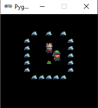
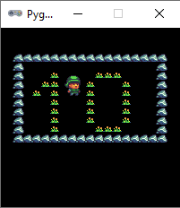

# Chapter 12 - Week 12

```
day0: Basics of Basics
day1: Basics of Basics
day2: Basics of Basics
day3: Basics of Basics
day4: Basics of Basics
day5: Basics of Basics
day6: Basics of Basics
```

## [DAY-82] Basics of Basics


simple game with history, press S to save your position to a list of positions, and then B to go back in time

```
import pgzrun
import random

HEIGHT = 200
WIDTH = 200

player = Actor("c1")
player.x = WIDTH/2
player.y = HEIGHT/2

history = []

def on_key_down(key):
    speed = 3
    
    if key == keys.UP:
        player.y -= speed
    if key == keys.DOWN:
        player.y += speed
    if key == keys.LEFT:
        player.x -= speed
    if key == keys.RIGHT:
        player.x += speed

    if key == keys.S:
        position = [player.x, player.y]
        history.append(position)

        print('append', history)

    if key == keys.B and len(history) > 0:        
        last = history.pop()
        player.x = last[0]
        player.y = last[1]

        print('pop', history)


def draw():
    screen.fill('black')
    player.draw()

pgzrun.go()
```

Two players, and more positions

```
import pgzrun
import random

HEIGHT = 200
WIDTH = 200
player1 = Actor("c1")
player2 = Actor('c2')
history = []

def on_key_down(key):
    speed = 10
    if key == keys.W:
        player1.y-= speed
    if key == keys.A:
        player1.x-=speed
    if key == keys.S:
        player1.y += speed
    if key == keys.D:
        player1.x += speed


    if key == keys.UP:
        player2.y-= speed
    if key == keys.LEFT:
        player2.x-=speed
    if key == keys.DOWN:
        player2.y += speed
    if key == keys.RIGHT:
        player2.x += speed

        
    if key == keys.F:
        positions = [player1.x,player1.y,player2.x,player2.y]
        history.append(positions)
        print('push', history)
    if key == keys.G:
        if len(history) > 0:
            positions = history.pop()
            player1.x = positions[0]
            player1.y = positions[1]
            player2.x = positions[2]
            player2.y = positions[3]
            print('pop', history)
        
def draw():
    screen.fill('black')
    player1.draw()
    player2.draw()
pgzrun.go()
```

More lists

```
a = ['h','w','e']
b = ['e','o','a']
c = ['l','r','r']
d = ['l','l','t']
e = ['o','d','h']

sum1 = ''
sum2 = ''

sum1 = a[0] + b[0] + c[0] + d[0] + e[0]
sum2 = a[1] + b[1] + c[1] + d[1] + e[1]

print(sum1)
print(sum2)

sum = []
for i in range(len(a)):
    sum.append('')
    sum[i] = a[i] + b[i] + c[i] + d[i] + e[i]


print(sum)
```

sum from the input

```
list = []
while True:
    integer = int(input('enter a number: '))
    list.append(integer)
    sum = 0
    for i in list:
        sum += i
        
    print(list, sum)
```

## [DAY-83] Basics of Basics




```
import pgzrun
import random

HEIGHT = 200
WIDTH = 200

player = Actor("c1")
player.x = WIDTH/2
player.y = HEIGHT/2

things = []

def on_key_down(key):
    speed = 10

    if key == keys.UP:
        player.y -= speed
    if key == keys.DOWN:
        player.y += speed
    if key == keys.LEFT:
        player.x -= speed
    if key == keys.RIGHT:
        player.x += speed

    if key == keys.F:
        thing = Actor("flower")
        thing.x = player.x
        thing.y = player.y

        things.append(thing)

    if key == keys.R:
        thing = Actor("rock")
        thing.x = player.x
        thing.y = player.y

        things.append(thing)


def draw():
    screen.fill('black')
    player.draw()
    for t in things:
        t.draw()

pgzrun.go()
```

With a function, so we can add more keys faster and we dont duplicate that much code

```
import pgzrun
import random

HEIGHT = 200
WIDTH = 200

player = Actor("c1")
player.x = WIDTH/2
player.y = HEIGHT/2

things = []
def place_thing(kind):
    thing = Actor(kind)
    thing.x = player.x
    thing.y = player.y

    things.append(thing)

def on_key_down(key):
    speed = 15
    
    if key == keys.UP:
        player.y -= speed
    if key == keys.DOWN:
        player.y += speed
    if key == keys.LEFT:
        player.x -= speed
    if key == keys.RIGHT:
        player.x += speed

    if key == keys.F:
        place_thing("flower")

    if key == keys.R:
        place_thing("rock")

    if key == keys.K:
        place_thing("c2")

def draw():
    screen.fill('black')
    player.draw()
    for t in things:
        t.draw()

pgzrun.go()
```

Now we can make a map, just add the kind of thing, its x and y position in a list and print it, after we are done building the map we can use it later

```
...
game_map = []
def place_thing(kind):
    thing = Actor(kind)
    thing.x = player.x
    thing.y = player.y

    things.append(thing)
    game_map.append([kind, thing.x, thing.y])
    print(game_map)
...    
```

use the map:


```
import pgzrun
import random

HEIGHT = 200
WIDTH = 200

player = Actor("c1")
player.x = WIDTH/2
player.y = HEIGHT/2

things = []
def place_thing(kind,x,y):
    thing = Actor(kind)
    thing.x = x
    thing.y = y
    things.append(thing)

def on_key_down(key):
    speed = 15
    
    if key == keys.UP:
        player.y -= speed
    if key == keys.DOWN:
        player.y += speed
    if key == keys.LEFT:
        player.x -= speed
    if key == keys.RIGHT:
        player.x += speed
def draw():
    screen.fill('black')
    player.draw()
    for t in things:
        t.draw()

game_map = [['rock', 100.0, 55.0], ['flower', 100.0, 85.0], ['c2', 100.0, 130.0], ['c2', 70.0, 130.0], ['c2', 55.0, 130.0], ['c2', 40.0, 130.0], ['c2', 25.0, 130.0], ['c2', 25.0, 100.0], ['c2', 25.0, 85.0], ['c2', 25.0, 70.0], ['c2', 25.0, 55.0], ['c2', 25.0, 40.0], ['c2', 25.0, 25.0], ['c2', 40.0, 25.0], ['c2', 55.0, 25.0], ['c2', 70.0, 25.0], ['c2', 85.0, 25.0], ['c2', 100.0, 25.0], ['c2', 115.0, 25.0], ['c2', 130.0, 25.0], ['c2', 145.0, 25.0], ['c2', 145.0, 40.0], ['c2', 145.0, 55.0], ['c2', 145.0, 70.0], ['c2', 145.0, 85.0], ['c2', 145.0, 100.0], ['c2', 145.0, 115.0], ['c2', 145.0, 130.0], ['c2', 130.0, 130.0], ['c2', 115.0, 130.0], ['c2', 100.0, 130.0], ['c2', 85.0, 130.0], ['c2', 25.0, 115.0]]
for g in game_map:
    place_thing(g[0],g[1],g[2])

pgzrun.go()
```





Another way to do it, press S to print the list of things, and then paste it in the game[] list to use it, D deletes things where you stand, and U removes the last thing

```
import pgzrun
import random

HEIGHT = 200
WIDTH = 200

player = Actor("c1")

things = []

game = []
for g in game:
    t = Actor(g[0])
    t.x = g[1]
    t.y = g[2]
    things.append(t)

def on_key_down(key):
    speed = 10

    if key == keys.UP:
        player.y -= speed
    if key == keys.DOWN:
        player.y += speed
    if key == keys.LEFT:
        player.x -= speed
    if key == keys.RIGHT:
        player.x += speed
        
    if key == keys.F:
        f = Actor("flower")
        f.x = player.x
        f.y = player.y
        things.append(f)
    if key == keys.R:
        f = Actor("rock")
        f.x = player.x
        f.y = player.y
        things.append(f)

    if key == keys.U:
         things.pop()

    if key == keys.D:
        collide = []
        for t in things:
            if player.colliderect(t):
                collide.append(t)

        for t in collide:
            things.remove(t)
    
    if key == keys.S:
        positions = []
        for t in things:
            positions.append([t.image,t.x,t.y])
        print(positions)

def draw():
    screen.fill('black')
    player.draw()
    for t in things:
        t.draw()

pgzrun.go()
```

## [DAY-84] Basics of Basics


Lets visualize the list, try to delete from the middle, and see how the indexes change.


```
import pgzrun
import random

HEIGHT = 200
WIDTH = 200

player = Actor("c1")

things = []

def on_key_down(key):
    speed = 10

    if key == keys.UP:
        player.y -= speed
    if key == keys.DOWN:
        player.y += speed
    if key == keys.LEFT:
        player.x -= speed
    if key == keys.RIGHT:
        player.x += speed

    if key == keys.F:
        f = Actor("flower")
        f.x = player.x
        f.y = player.y
        things.append(f)
    if key == keys.R:
        f = Actor("rock")
        f.x = player.x
        f.y = player.y
        things.append(f)

    if key == keys.U:
         things.pop()

    if key == keys.D:
        collide = []
        for t in things:
            if player.colliderect(t):
                collide.append(t)

        for t in collide:
            things.remove(t)

def draw():
    screen.fill('black')
    player.draw()

    
    for i in range(len(things)):
        t = things[i]
        t.draw()
        screen.draw.text(str(i), color=(255,255,255), topleft=(t.x,t.y))
        if i > 0:
            p = things[i-1]
            screen.draw.line((p.x,p.y), (t.x,t.y), (255,255,255))
pgzrun.go()
```

spend more time thinking about connecting previous and current elements from a list, think about how to do it the other way around, from current element to next:

```
# change this to go from t to the next element of things, instead from t to previous
for i in range(len(things)):
    t = things[i]
    ...
    if i > 0:
        p = things[i-1]
        ...
```

## [DAY-85] Basics of Basics

This day is more about reading than writing, those are three different examples you can use


don't let the **zombie** flowers overrun you, smash them with rocks


```
import pgzrun
import random

HEIGHT = 200
WIDTH = 200

game_over = False

elf = Actor("c1")
elf.x = WIDTH/2
elf.y = HEIGHT-20
flowers = []
rocks = []

game_area = Rect((0, 0), (WIDTH, HEIGHT-40))

def add_one_row():
    lastY = 0
    if len(flowers) > 0:
        f = flowers[len(flowers)-1]
        lastY = f.y
    
    for i in range(20, WIDTH-10, 20):
        f = Actor("flower")
        f.x = i
        f.y = lastY + 10
        flowers.append(f)

def rock_out_of_screen():
    if len(rocks) > 0:
        rocks.pop(0)

def on_key_down(key):
    speed = 10
    if key == keys.LEFT:
        elf.x -= speed
    if key == keys.RIGHT:
        elf.x += speed
        
    if key == keys.SPACE:
        rock = Actor("rock")
        rock.x = elf.x
        rock.y = elf.y - 20
        animate(rock,pos=(rock.x, -100), on_finished=rock_out_of_screen)
        rocks.append(rock)

def update():
    global game_over
    hit = []
    for b in rocks:
        for f in flowers:
            if b.colliderect(f) and random.randint(0,10) > 7:
                hit.append(f)

    for h in hit:
        flowers.remove(h)

    for f in flowers:
        if not f.colliderect(game_area):
            game_over = True


def draw():
    if game_over:
        screen.draw.text("GAME OVER", color="white", topleft=(10,10))
    else:
        screen.fill('black')
        elf.draw()
        for f in flowers:
            f.draw()
        for r in rocks:
            r.draw()

        screen.draw.rect(game_area, (200, 0, 0))

add_one_row()
clock.schedule_interval(add_one_row, 5)

pgzrun.go()
```


```
import turtle as t
size = 10
t.pensize(size)
t.left(45)
t.forward(90)
t.circle (45,extent=180)
t.right(90)
t.circle(45,extent=180)
t.forward(90)
t.penup()
t.goto(-35,-35)
t.pendown()
t.write('i love python')
t.penup()
```


```
import  turtle as t
import datetime
import time
def deg(h,m,s):
	hDeg=(h*3600+m*60+s)/(3600*12)*360
	mDeg=(m*60+s)/3600*360
	sDeg=360/60*s
	
	return (90+hDeg,90+mDeg,90+sDeg)
	
	
def show(h, size):
	(hDeg,m,s) = deg(h,0,0)
	
	t.penup()
	t.goto(0, size)
	t.pencolor('white')
	t.setheading(hDeg)
	t.forward(size)
	t.write(str(h))
	
def klok(size, h, m, s):
	t.reset()
	(hDeg,mDeg,sDeg) = deg(h,m,s)
	
	t.pendown()
	t.pensize(7)
	t.bgcolor('black')
	t.pencolor('lime')
	
	t.circle(size)
	
	t.penup()
	t.goto(0, size)
	t.setheading(hDeg)
	t.pendown()
	t.pencolor('springgreen')
	t.forward(size/3)
	
	
	t.penup()
	t.goto(0, size)
	t.setheading(mDeg)
	t.pendown()
	t.pencolor('lawngreen')
	t.forward(size/2)
	t.penup()
	t.pencolor('cyan')
	t.goto(0, size)
	t.setheading(sDeg)
	t.pendown()
	t.forward(size-25)
	t.penup()
	
size = 150
while True:
	now = datetime.datetime.now()
	klok(size,now.hour, now.minute, now.second)
	for h in range(1, 13):
		show(h,size)
	time.sleep(10)
```

## [DAY-86] Basics of Basics
## [DAY-87] Basics of Basics
## [DAY-88] Basics of Basics
