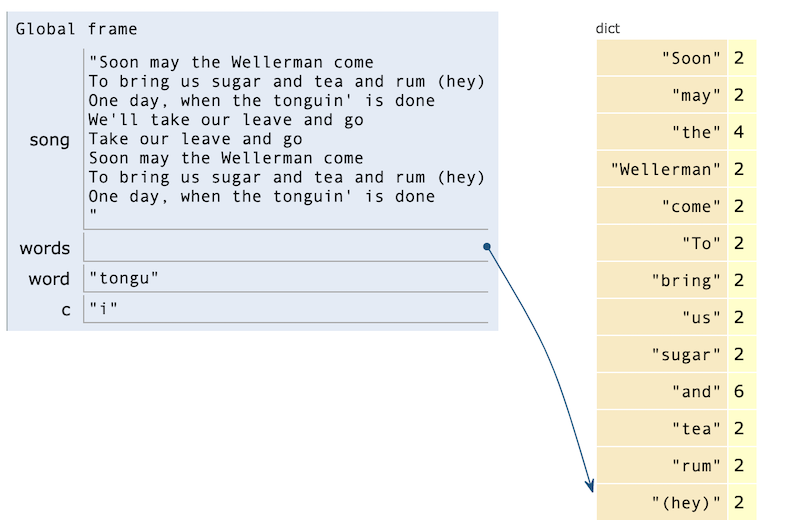

# Chapter 14 - Week 14

```
day0: Basics of Basics
day1: Basics of Basics
day2: Basics of Basics
day3: Basics of Basics
day4: Basics of Basics
day5: Basics of Basics
day6: Basics of Basics
```

## [DAY-109] Basics of Basics

Touchtyping day!

## [DAY-110] Basics of Basics


follow zippycode on tiktok https://www.tiktok.com/@zippycode
try some of their ideas, like:

```
from turtle import *
bgcolor('black')
n = 0
colormode(255)
while n < 200:
    right(n)
    forward(n*3)
    color(n,255-n,n%30*8)
    n+=1
```


```
from turtle import *
color('green')
speed(11)
i = 0
while True:
    circle(i*1.5)
    right(4)
    i+=1
```

## [DAY-111] Basics of Basics


```
import pgzrun
import random

WIDTH = 400
HEIGHT = 400
fox = Actor("c1")
fox.x= WIDTH/2
fox.y=HEIGHT/2

other = [
    Actor("c2", pos=(100,100)),
    Actor("c2", pos=(100,300)),
    Actor("c2",pos=(300,300)),
    Actor("c2",pos=(300,100))
]


def update():
    if keyboard.left:
        for o in other:
            o.x += 5
    if keyboard.right:
        for o in other:
            o.x -= 5
    if keyboard.up:
        for o in other:
            o.y += 5
    if keyboard.down:
        for o in other:
            o.y -= 5

    for o in list(other):
        if o.colliderect(fox):
            other.remove(o)
    if len(other) < 4:
        other.append(Actor("c2",pos=(random.randint(10,WIDTH-10), random.randint(10,HEIGHT-10))))

    for o in other:
        o.y -=1

def draw():
    screen.clear()
    screen.fill("deepskyblue")
    fox.draw()
    for o in other:
        o.draw()
pgzrun.go()
```

## [DAY-112] Basics of Basics

Count the words in a song

```
song = """There once was a ship that put to sea
The name of the ship was the Billy of Tea
The winds blew up, her bow dipped down
O blow, my bully boys, blow (huh)
She had not been two weeks from shore
When down on her a right whale bore
The captain called all hands and swore
He'd take that whale in tow (huh)
Soon may the Wellerman come
To bring us sugar and tea and rum (hey)
One day, when the tonguin' is done
We'll take our leave and go
Take our leave and go
Soon may the Wellerman come
To bring us sugar and tea and rum
One day, when the tonguin' is done
We'll take our leave and go
Before the boat had hit the water
The whale's tail came up and caught her
All hands to the side harpooned and fought her
When she dived down below (huh)
She had not been two weeks from shore
When down on her a right whale bore
The captain called all hands and swore
He'd take that whale in tow (huh)
Soon may the Wellerman come
To bring us sugar and tea and rum (hey)
One day, when the tonguin' is done
We'll take our leave and go
Take our leave and go
Soon may the Wellerman come
To bring us sugar and tea and rum
One day, when the tonguin' is done
We'll take our leave and go
Soon may the Wellerman come
To bring us sugar and tea and rum (hey)
One day, when the tonguin' is done
We'll take our leave and go
Take our leave and go
Take our leave and go
"""

words = {}
word = ''
for c in song:
    if c == ' ' or c == '\n':
        if word not in words:
            words[word] = 1
        else:
            words[word] += 1
        word = ''
    else:
        word += c

for word in words:
    print(words[word],word)
```

This program has a bug, if the file does not end with empty line, it wont count the last word.

Print the length:

```
...
l = 0
for c in song:
    l += 1
print(l)
print(len(song))
```

## [DAY-113] Basics of Basics

use https://pythontutor.com/visualize.html with the folloowing code:

```
song = """Soon may the Wellerman come
To bring us sugar and tea and rum (hey)
One day, when the tonguin' is done
We'll take our leave and go
Take our leave and go
Soon may the Wellerman come
To bring us sugar and tea and rum (hey)
One day, when the tonguin' is done
"""

words = {}
word = ''
for c in song:
    if c == ' ' or c == '\n':
        if word not in words:
            words[word] = 1
        else:
            words[word] += 1
        word = ''
    else:
        word += c

for word in words:
    print(words[word],word)

```




try it with other programs as well.

## [DAY-114] Basics of Basics
## [DAY-115] Basics of Basics
