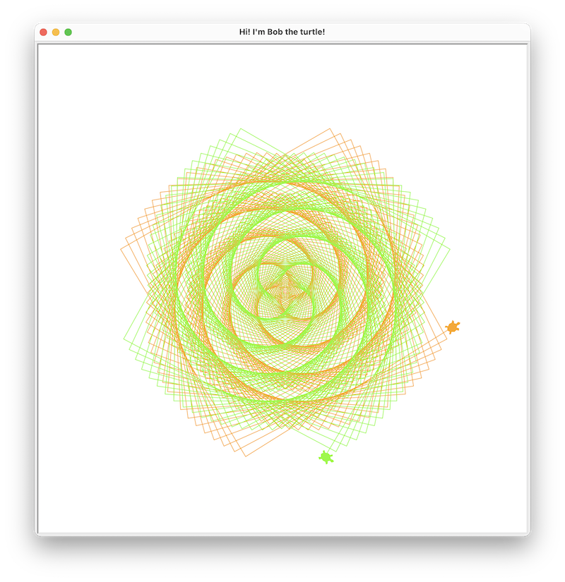

# Chapter 14 - Week 14

```
day0: Basics of Basics
day1: Basics of Basics
day2: Basics of Basics
day3: Basics of Basics
day4: Basics of Basics
day5: Basics of Basics
day6: Basics of Basics
```

## [DAY-116] Basics of Basics

Many Turtles.

The ideas are borrowed from [Redisovering Logo with Bob the Turtle](https://notes.ayushsharma.in/2019/06/rediscovering-logo-with-bob-the-turtle), Ayush Sharma's amazing blog post!



```
import turtle

turtle.setup(width=800, height=800)

bob = turtle.Turtle(shape='turtle')
bob.color('orange')
bob.speed(3000)

alice = turtle.Turtle(shape='turtle')
alice.color('lawngreen')
alice.speed(3000)

for i in range(500):

    bob.forward(i)
    bob.left(91)

    alice.backward(i)
    alice.right(91)

turtle.exitonclick()
```

even more turtles


```
import turtle

turtle.setup(width=800, height=800)

bob = turtle.Turtle(shape='turtle')
bob.color('orange')
bob.speed(3000)

alice = turtle.Turtle(shape='turtle')
alice.color('lawngreen')
alice.speed(3000)


charlie = turtle.Turtle(shape='turtle')
charlie.color('deepskyblue')
charlie.speed(3000)

for i in range(500):

    bob.forward(i)
    bob.left(91)

    alice.backward(i)
    alice.right(91)

    charlie.forward(i)
    charlie.right(101)

turtle.exitonclick()
```

```
import turtle
turtle.setup(width=800, height=800)

bob = turtle.Turtle(shape='turtle')
bob.color('orange')

alice = turtle.Turtle(shape='turtle')
alice.color('lawngreen')
angle = 10
while True:
    alice.backward(20)
    bob.forward(20)
    alice.right(angle)
    bob.left(angle)
    angle += 1
```

Again this is the same as in roblox's houses, you have the blueprint of the house, and you can create an instance of it, and then you can modify it. so `turtle.Turtle()` creates an instance, and then you see, bob, alice and charlie have their own changes. In the same time they have the same functionality, like `forward` `up` and etc coming from the blueprint and each of those methods work on the instance itself.

## [DAY-117] Basics of Basics


And lets discuss another text editor.

(if you are on windows make sure you `pip3 install windows-curses`)

Start super simple, what do we need to make a text editor? first we need to show the text being edited, and second we need to capture user input and modify this text.

First show some text:

```
import curses
import time

screen = curses.initscr()
screen.addstr(0, 0, "hello world",curses.A_NORMAL)
screen.refresh()

time.sleep(2)
```

Capture input and modify the text:

```
import curses

screen = curses.initscr()
text = ''
while True:
    screen.addstr(0, 0, text,curses.A_NORMAL)
    screen.refresh()

    c = screen.getch()
    text += chr(c)
```

In order to Read and Write the file we are editing, we need to have some control keys, like Ctrl+S to save, and Ctrl+C to quit without saving. Also we need to add support for backspace to be able to delete from the text string.

Hint: use `text += str(c)` to actually see the codes you need.

```
import curses
import sys

screen = curses.initscr()
curses.curs_set(2)

if len(sys.argv) != 2:
    print("usage:")
    print(sys.argv[0] + " filename")
    sys.exit(1)


text = ''
try:
    file = open(sys.argv[1],"r")
    text = file.read()
    file.close()
except:
    pass

status = 'file: ' + sys.argv[1]
while True:
    screen.clear()
    screen.addstr(0, 0, status + ' (len: ' + str(len(text)) + ')',curses.A_NORMAL)
    screen.addstr(2, 0, text,curses.A_NORMAL)
    screen.refresh()

    c = screen.getch()
    if c == 3:
        # quit Ctrl+C
        break

    if c == 19:
        # save Ctrl+S
        file = open(sys.argv[1],"w")
        file.write(text)
        file.close()
        status = 'file: ' + sys.argv[1]
        screen.addstr(0, 0, text,curses.A_NORMAL)
        continue
    if c == 8:
        # backspace
        if len(text) > 0:
            text = text[:len(text)-1]
        continue
    if (c < 127 and c > 30) or c == 10:
        text += chr(c)
        status = 'file: ' + sys.argv[1] + " (modified)"

```

## [DAY-118] Basics of Basics
## [DAY-119] Basics of Basics
## [DAY-120] Basics of Basics
## [DAY-121] Basics of Basics
## [DAY-122] Basics of Basics

