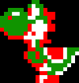
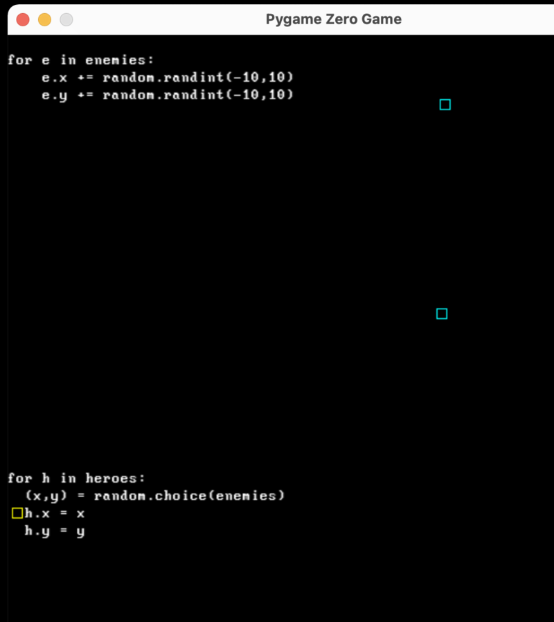

# Chapter 14 - Week 14

```
day0: Basics of Basics
day1: Basics of Basics
day2: Basics of Basics
day3: Basics of Basics
day4: Basics of Basics
day5: Basics of Basics
day6: Basics of Basics
```

## [DAY-123] Basics of Basics


a bit more complicated game

```
import pgzrun
import random
from itertools import cycle
WIDTH = 300
HEIGHT = 300
game_over = False
player = Actor("c1", pos=((WIDTH/2), (HEIGHT-16)), anchor=("center","bottom"))
obsticles = []

def jump_up(jumper):
    sounds.jump.play()
    animate(jumper, tween='decelerate', duration=0.3, pos=(jumper.x, jumper.y - 16),on_finished=lambda: jump_down(jumper))

def jump_down(jumper):
    animate(jumper, tween='accelerate', duration=0.3, pos=(jumper.x, HEIGHT-16))

def on_key_down(key):
    if key == keys.SPACE:
        jump_up(player)

def make_obsticles():
     for i in range(0, 5 - len(obsticles)):
        # check if colliding, add random + 20 to it
        actor = Actor(random.choice(["o1","o2","o3","o4","o5","o6","o7","o8","o9","o10","o11"]), anchor=("center","bottom"))
        actor.x = WIDTH + 40 + random.randint(10, WIDTH*2)
        actor.y = HEIGHT - 16
        while True:
            actor.x += random.randint(30, 50)
            conflict = False
            for o in obsticles:
                if o.colliderect(actor):
                    conflict = True
            if not conflict:
                break

        obsticles.append(actor)

def update():
    global game_over

    if len(obsticles) < 5:
        make_obsticles()

    for o in list(obsticles):
        # shrink the collision rects so the game is more fun to play
        if o.inflate(-4,-4).colliderect(player.inflate(-16,-16)):
            game_over = True

        # remove the obsticles out of screen
        o.x -= 2
        if o.x < -10:
            obsticles.remove(o)


# player animation
# we just change the image of the actor every 0.4 seconds
poses = cycle(["player/tiles-46","player/tiles-47","player/tiles-48","player/tiles-49","player/tiles-50","player/tiles-51"])
def make_actor_move():
    player.image = next(poses)
clock.schedule_interval(make_actor_move, 0.4)

def draw():
    screen.fill("black")
    player.draw()
    for o in obsticles:
        o.draw()

    for i in range(100):
        screen.blit('floor',(i * 16, HEIGHT - 16))

    if game_over:
        screen.fill("red")

pgzrun.go()

```
## [DAY-124] Basics of Basics

Images

The way we store image is very similar to the way we store text. It is just a bunch of bytes, but when we read them we decide to interpret them differently.

Open images/joshi-100.bmp and you will see: 

 

Now lets just read the bytes, and just show the numbers, starting at position 54, when we print new line every 106, and also we are gonna print every 4th byte.

first just print the byutes:


```
file = open("images/joshi-100.bmp","rb")
data = file.read()
file.close()

for b in data:
    print("%3d" % b,end='')
```

now lets print them in specific order:

```
file = open("images/joshi-100.bmp","rb")
data = file.read()
file.close()

width = 100
height = 106
offset = 54

for y in range(width):
    for x in range(height):
        off = offset + ((y * width + x) * 4)
        print("%3d" % data[off+2],end='')
    print()
```


looks familiar!

The image itself actually contains information about how big it is, and where the data starts, it is specified in the bitmap format itself.


Here is the bitmap header information, copied from: http://www.ece.ualberta.ca/~elliott/ee552/studentAppNotes/2003_w/misc/bmp_file_format/bmp_file_format.htm

| Name | Size | Offset | Description |
| - | - | - | - |
| **Header** | 14 bytes | | Windows Structure: BITMAPFILEHEADER |
| Signature | 2 bytes | 0000h | 'BM' |
| FileSize | 4 bytes | 0002h | File size in bytes |
| reserved | 4 bytes | 0006h | unused (=0) |
| DataOffset | 4 bytes | 000Ah | Offset from beginning of file to the beginning of the bitmap data |
| **InfoHeader** | 40 bytes | | Windows Structure: BITMAPINFOHEADER |
| Size | 4 bytes | 000Eh | Size of InfoHeader =40 |
| Width | 4 bytes | 0012h | Horizontal width of bitmap in pixels |
| Height | 4 bytes | 0016h | Vertical height of bitmap in pixels |
| Planes | 2 bytes | 001Ah | Number of Planes (=1) |
| Bits Per Pixel | 2 bytes | 001Ch | Bits per Pixel used to store palette entry information. This also identifies in an indirect way the number of possible colors. Possible values are:<br>1 = monochrome palette. NumColors = 1 <br>4 = 4bit palletized. NumColors = 16 <br>8 = 8bit palletized. NumColors = 256 <br>16 = 16bit RGB. NumColors = 65536<br>24 = 24bit RGB. NumColors = 16M |
| Compression | 4 bytes | 001Eh | Type of Compression <br>0 = BI\_RGB no compression <br>1 = BI\_RLE8 8bit RLE encoding <br>2 = BI\_RLE4 4bit RLE encoding |
| ImageSize | 4 bytes | 0022h | (compressed) Size of Image <br>It is valid to set this =0 if Compression = 0 |
| XpixelsPerM | 4 bytes | 0026h | horizontal resolution: Pixels/meter |
| YpixelsPerM | 4 bytes | 002Ah | vertical resolution: Pixels/meter |
| Colors Used | 4 bytes | 002Eh | Number of actually used colors. For a 8-bit / pixel bitmap this will be 100h or 256. |
| Important Colors | 4 bytes | 0032h | Number of important colors <br>0 = all |
| **ColorTable** | 4 \* NumColors bytes | 0036h | present only if Info.BitsPerPixel less than 8 <br>colors should be ordered by importance |
| Red | 1 byte | | Red intensity |
| Green | 1 byte | | Green intensity |
| Blue | 1 byte | | Blue intensity |
| reserved | 1 byte | | unused (=0) |
| repeated NumColors times |
| **Pixel Data** | InfoHeader.ImageSize bytes | | The image data

Now using the header information, we can get the width, height and data offset directly from there:

```
file = open("images/joshi-100.bmp","rb")
data = file.read()
file.close()

offset = int.from_bytes(data[10:14], byteorder='little')
width = int.from_bytes(data[18:22], byteorder='little')
height = int.from_bytes(data[22:26], byteorder='little')

for y in range(width):
    for x in range(height):
        off = offset + ((y * width + x) * 4)
        print("%3d" % data[off+2],end='')
    print()
```

You see when we read `data[10:14]` we want to skip `signature` (2 bytes), `file size` (4 bytes) and `reserved` (4 bytes) and read exactly 4 bytes after that.
And we can make 4 bytes into a integer with `int.from_bytes`. We will get into that later. For now the important thing to focus on is the format itself.

It has a header, followed up by data. This is very common method and you will see it in all kinds of places. Even in our virtual computer when we were storing the strings we used a similar method, the first byte was always the length of the string.


## [DAY-125] Basics of Basics




Write code to destroy your enemies!

You have access to your `heroes` and `enemies` positions. When you collide you destroy each other.

```import pgzrun
import random
from itertools import cycle

WIDTH=600
HEIGHT=600

enemies = []
heroes = []

text = """
for h in heroes:
    h.x += random.randint(-10,10)
    h.y += random.randint(-10,10)
"""

enemy_programs = cycle([
"""
i = 0
for e in enemies:
    e.x = i * 10
    e.y = i * 10
    i += 1
""",
"""
for e in enemies:
    e.x += random.randint(-10,10)
    e.y += random.randint(-10,10)
""",
"""
for e in enemies:
    (x,y) = random.choice(heroes)
    e.x = x
    e.y = y
"""
])

enemy_code = None

def reset():
    global heroes, enemies, enemy_code
    enemy_code = next(enemy_programs)
    enemies = []
    heroes = []
    for i in range(20):
        enemies.append(Rect(random.randint(0,WIDTH),random.randint(0,HEIGHT), 10, 10))
        heroes.append(Rect(random.randint(0,WIDTH),random.randint(0,HEIGHT), 10, 10))


def on_key_down(key, mod, unicode):
    global text, pause, score_words, score
    if key == keys.BACKSPACE:
        if mod == 1024 or mod == 256:
            text = ''
        if len(text) > 0:
            text = text[:-1]
    elif key == keys.SPACE:
        text += ' '
    elif key == keys.TAB:
        text += '  '        
    elif key == keys.RETURN:
        text += '\n'        
    elif len(unicode) > 0 and ord(unicode) >= 34 and ord(unicode) <= 126:
        text += unicode

def run_code():
    try:
        enemy_positions = []
        for e in enemies:
            enemy_positions.append((e.x, e.y))
        hero_positions = []
        for h in heroes:
            hero_positions.append((e.x, e.y))            
        exec(text, {"heroes": heroes,"random":random, "enemies": enemy_positions})
        exec(enemy_code, {"enemies": enemies, "random":random, "heroes": hero_positions})

        for h in list(heroes):
            collided = False
            for e in list(enemies):
                if e.colliderect(h):
                    enemies.remove(e)
            if collided:
                heroes.remove(h)                    
        if len(enemies) < 50:
            enemies.append(Rect(random.randint(0,WIDTH),random.randint(0,HEIGHT), 10, 10))

        heroes.append(Rect(random.randint(0,WIDTH),random.randint(0,HEIGHT), 10, 10))
        if len(enemies) < 5:
            reset()

    except Exception as err:
        print(err)
        pass

reset()

clock.schedule_interval(run_code, 1)
def draw():
    screen.fill("black")

    screen.draw.text("heroes: " + str(len(heroes)) + " enemies: " + str(len(enemies)), (0, 0), align='left',fontname="437-win", fontsize=20)
    for (i,l) in enumerate(enemy_code.split('\n')):
        screen.draw.text(l, (0, (20 + (i * 16))), align='left',fontname="437-win", fontsize=14)


    for (i,l) in enumerate(text.split('\n')):
        screen.draw.text(l, (0, (HEIGHT - 200 + (i * 16))), align='left',fontname="437-win", fontsize=14)

    for e in enemies:
        screen.draw.rect(e, (255,0,0))
    for h in heroes:
        screen.draw.rect(h, (0,255,255))

pgzrun.go()
```

## [DAY-126] Basics of Basics
## [DAY-127] Basics of Basics
## [DAY-128] Basics of Basics
## [DAY-129] Basics of Basics

