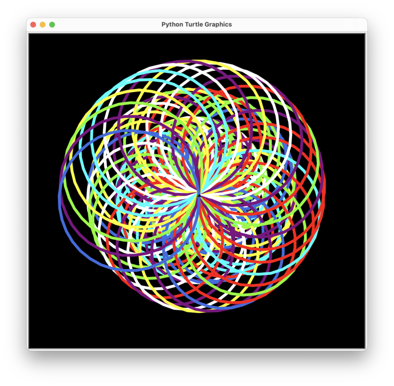
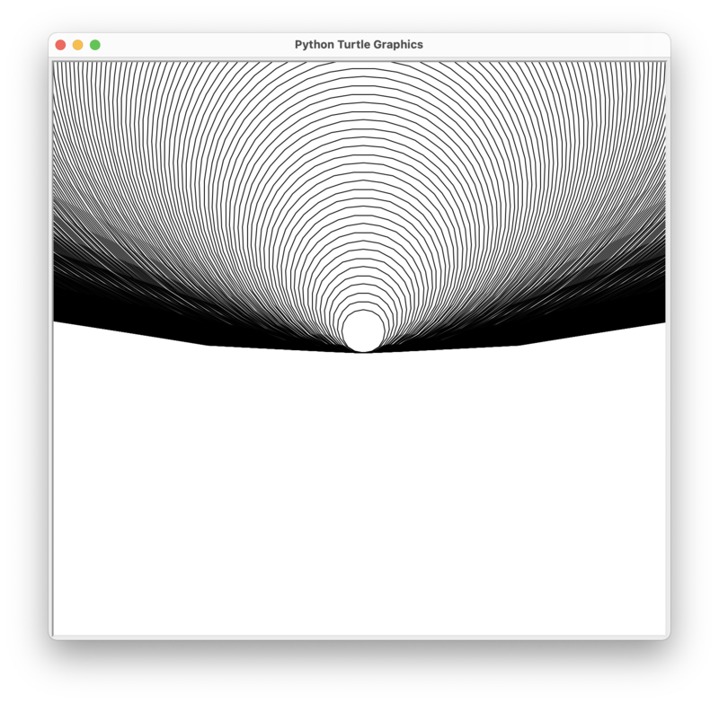
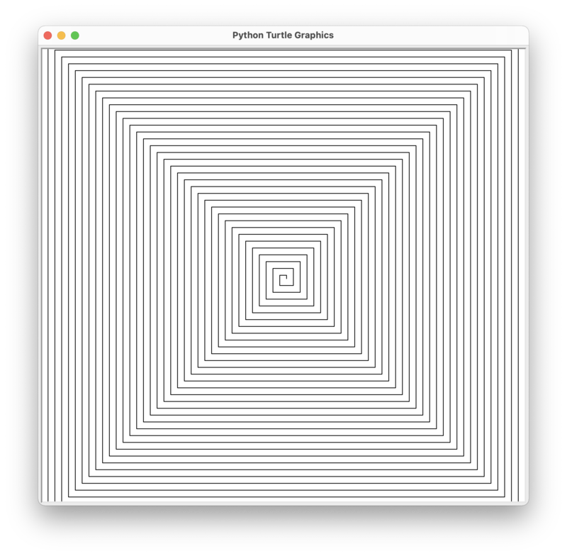
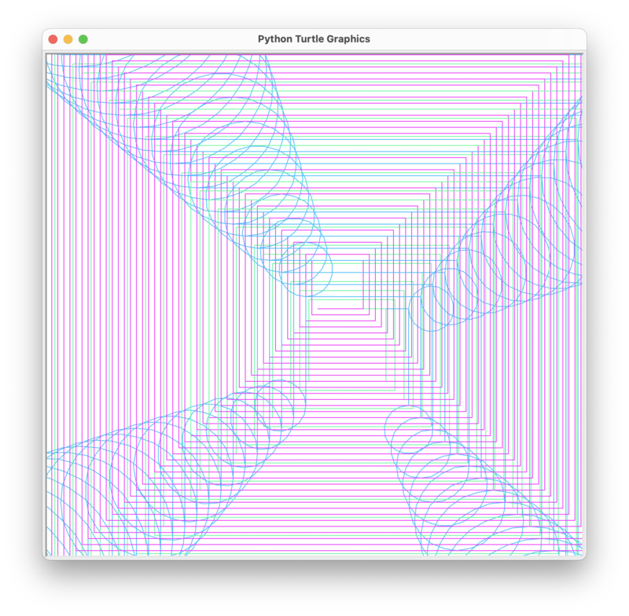
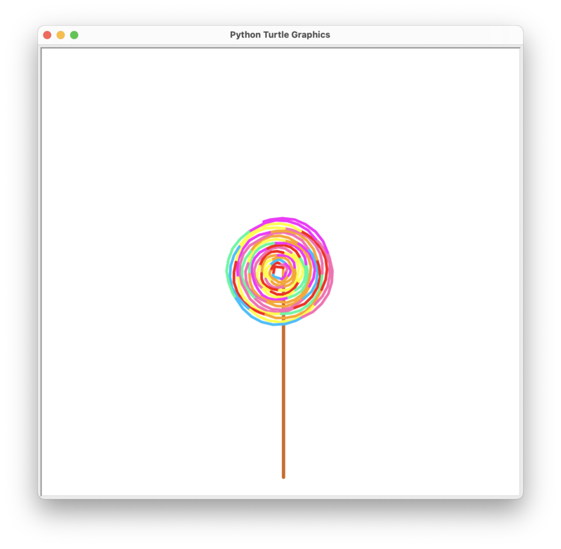
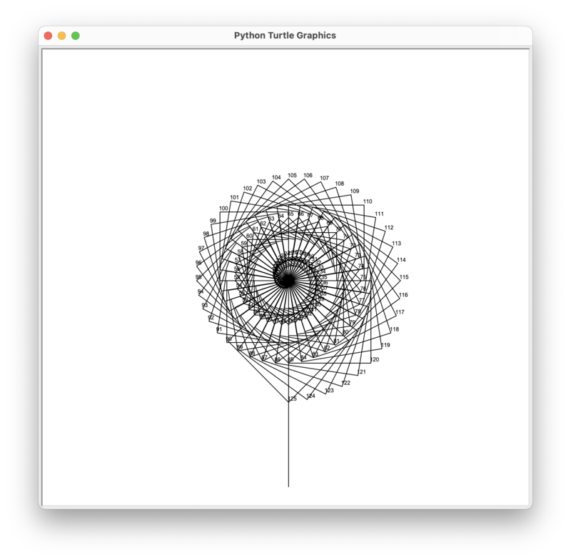

## [DAY-143] Strings

Print the characters of a string one by one:

```
a = 'hello'
for i in a:
    print(i)
```

Print the characters and their index:

```
a = 'hello'
for i in range(0,len(a)):
    print(i, a[i])
```

Reverse the characters:

```
a = 'hey'
rev = ''
for i in range(0,len(a)):
    # i = 0
    # a[2 - 0] -> a[2] -> y
    # i = 1
    # a[2 - 1] -> a[1] -> e
    # i = 2
    # a[2 - 2] -> a[0] -> h
    print(i,a[len(a)-1-i])
    rev +=a[len(a)-1-i]
print(rev)
```

Google 'how to reverse a string in python'

```
a = 'hello'
b = a[len(a)::-1]
print(b)
```

check out the stackoverflow explanation at https://stackoverflow.com/questions/509211


Answer by Greg Hewgill, https://stackoverflow.com/users/893/greg-hewgill
```

It's pretty simple really:

a[start:stop]  # items start through stop-1
a[start:]      # items start through the rest of the array
a[:stop]       # items from the beginning through stop-1
a[:]           # a copy of the whole array
There is also the step value, which can be used with any of the above:

a[start:stop:step] # start through not past stop, by step
The key point to remember is that the :stop value represents the first value that
 is not in the selected slice. So, the difference between stop and start is the 
 number of elements selected (if step is 1, the default).

The other feature is that start or stop may be a negative number, which means it 
counts from the end of the array instead of the beginning. So:

a[-1]    # last item in the array
a[-2:]   # last two items in the array
a[:-2]   # everything except the last two items
Similarly, step may be a negative number:

a[::-1]    # all items in the array, reversed
a[1::-1]   # the first two items, reversed
a[:-3:-1]  # the last two items, reversed
a[-3::-1]  # everything except the last two items, reversed

Python is kind to the programmer if there are fewer items than you ask for. For example, 
if you ask for a[:-2] and a only contains one element, you get an empty list instead of 
an error. Sometimes you would prefer the error, so you have to be aware that this may happen.

Relation to slice() object
The slicing operator [] is actually being used in the above code with a slice() object 
using the : notation (which is only valid within []), i.e.:

a[start:stop:step]
is equivalent to:

a[slice(start, stop, step)]

Slice objects also behave slightly differently depending on the number of arguments, 
similarly to range(), i.e. both slice(stop) and slice(start, stop[, step]) are 
supported. To skip specifying a given argument, one might use None, so that e.g. 
a[start:] is equivalent to a[slice(start, None)] or a[::-1] is equivalent to 
a[slice(None, None, -1)].

While the :-based notation is very helpful for simple slicing, the explicit use of 
slice() objects simplifies the programmatic generation of slicing.
```

## [DAY-144] Strings; Lists

Sum the ascii of the elements of a list.

```
a = ['h','e','l','l','o']
sum = 0
for i in a:
    sum += ord(a)

print(sum)
```

Print its index, and the letter with the corresponding ascii

```
a = ['h','e','l','l','o']
sum = 0
for i in range(len(a)):
    m = ord(a[i])
    print('index: ', i, a[i], '=', m)
    sum += m

print(sum)
```

Now do the same with a string

```
a = 'hello'
sum = 0
for i in range(len(a)):
    m = ord(a[i])
    print('index: ', i, a[i], '=', m)
    sum += m

print(sum)
```

See how lists and strings both have len() and are indexable, meaning you can go to a specific index a[i] and do something.

You can mutate (change) the list, meaning you can change its content

```
a = ['h','e','l','o']
a[2] = 'b'
print(a)
```

But you can not change a string inplace:

```
a = 'hello'
a[2] = 'b'
print(a)
```

You will get `TypeError: 'str' object does not support item assignment`. If you want to change a string, you have to make a new one and reasign the variable to point to the new string.

```
a = 'hello'

a = a[0:2] + 'b' + a[3:5]
```

See how we make completely new string, made up from the parts of the old string, and also the letter 'b' in the middle, and we make the variable `a` point to the new string.


## [DAY-145] While

More turtle




```
import turtle as t
import random

t.bgcolor('black')
t.pensize(6)
t.speed(0)

size = 20
colors =['cyan','royalblue','lawngreen','red','purple','white','yellow']

while True:
    t.pencolor(random.choice(colors))
    t.circle(size)
    t.left(12)

    size += 1
```




```
from turtle import *

size = 20
speed(0)
hideturtle()

while True:
    size += 5

    circle(size)
```



```
import turtle as t 

size = 0
t.speed(0)

while True:
    t.forward(size)
    t.left(90)

    size += 1
```


Lets talk again about Memory.

```
a = 'hello'
print(len(a))
a += 'b'
print(len(a))
print(a[2])
```

First lets imagine a simplified representation of the string 'hello' in memory. 

Lets imagine the computer memory as a long line of numbered boxes, so we can go directly to specific box

```
[-------------------------------------------------------------------------]
 0                                                                       1024
```

Each of the boxes can contain value between 0 and 255, so in order to store our string, we need at least 5 boxes, one for each letter, the memory does not understand such thing as character, only numnbers between 0 and 255, that is why we have the ASCII table, to have a standard how to represent characters as numbers in a common way. So we will store `h` which is 104 and, `e` which is 101, etc

Lets say that python finds out some free memory at address 555, and we just store 104,101,108,108,111, The problem with that is that we dont know when the string actually ends, so either we have to read to the first `0`, or we have to store the length of the string, and usually you store the length. So we will store the number 5, which we know is the length, and then the ASCII characters.

```
[--------------5 104 101 108 108 111----------------------------------------------]
 0             ^                                                                 1024
               555
```

Now the variable `a` just points to box 555, when we do `len(a)` we can just read the number stored at this address, and when we do `a[1]` we can read the value at address `555 + 1 + 1` which will give us (101)


What happens now when we do `a += 'b'`, this is the same as `a = a + 'b'`, which means ok, lets make a new string, with size `6` copy the original string there, and then add `b` (which is 98 in ascii) to the end. So python will try to find a space in memory for at least 7 bytes (6 for the string, and one for the lenth), and do the copy.

```
[--------------5 104 101 108 108 111------6 104 101 108 108 111 98----------------]
 0             ^                          ^                                      1024
             555                         763  
```


Imagine the next free space in memory is on address 763, it will copy the data from address 556 to 560 to address 764 to 769, it will put `98` on address 770 and of course it will place the number `7` (the length of the new string), on address 763. And now we have a new string, it will just re-assign the variable `a` to point to 763 instead of 555. Now the string on address 555 is not referenecd by any variable, and if it is not used by anything else (e.g. a list that also points to it), it can be garbage collected, and memory can be marked as free.


Lets talk about this code:

```
a = 'he'
b = 'lo'
c = 6
d = [a,b,c]
print(d[1])
```

One way python could represent a list is very similar to a string, you have length, and just addressess of the elements


```
[---3 555 763 847-----------2 104 101 ----------------2 108 111 ------6-----------]
 0  ^                       ^                         ^               ^          1024
    125                    555                       763             847 
```


The variable d will point to address `125`, from there you have first element on address 555, second on 763 and third on 847, to do `print(d[1]`) means go to 125 + 1 + 1, and follow the pointer, so go to 555 ... and so on.

See there is a small problem because now python does not know if certain address contains a string, number or a list, so usually you need one more byte of information for the type of the object. Imagine 1 is for integer, 2 for string and 3 for list.

```
[---3 2 555 763 847-------2 2 104 101 --------------2 2 108 111 -----1 6----------]
 0  ^                     ^                         ^                ^           1024
    125                  555                       763               847 
```

ok now its eaier :) we know when we go to certain address of some data what to expect, so we know if we should print ascii or the number itself, or follow the reference to wherever it goes.   

## [DAY-146] While; Classes

Circles And Squares.




```
import turtle as t

a = t.Turtle()
a.speed(0)
a.pencolor('fuchsia')

b = t.Turtle()
b.speed(0)
b.pencolor('mediumspringgreen')


c = t.Turtle()
c.speed(0)
c.pencolor('deepskyblue')

size = 30

while True:
    a.forward(size*2)
    a.left(90)
    b.forward(size*3)
    b.right(90)
    c.forward(size*4)
    c.right(90)
    c.circle(size+1)

    size += 2
```





```
import turtle as t
import random

a = t.Turtle()
a.speed(0)

b = t.Turtle()
b.speed(0)

b.hideturtle()
a.hideturtle()

b.pensize(5)
a.pensize(4)

b.pencolor('chocolate')

b.right(90)
b.forward(300)

size = 0
for i in range(70):
    a.pencolor(random.choice(['red','orange','yellow','hotpink','magenta','deepskyblue','mediumspringgreen']))
    b.right(180)
    a.circle(size,extent=90)
    a.forward(10)
    a.right(5)
    size += 1
t.done()
```


## [DAY-147] While

Another flower




```
import turtle as t

a = t.Turtle()
a.speed(0)
a.right(90)
a.forward(300)
a.hideturtle()

b = t.Turtle()
b.speed(0)
b.hideturtle()

def square(charlie, size):
    for i in range(4):
        charlie.forward(size)
        if i == 1:
            charlie.write(str(size))
        charlie.right(90)

size = 0
while True:
    square(b,size)
    b.right(9)
    size += 1
    if size > 125:
        break

t.done()
```

## [DAY-148] Money

Every time you use something, ask yourself how does the company that made it make money. How can it be so expensive or so cheap, or worse, how can it be free.


Most of the things you own and use are made by for-profit companies, for-profit means that the company tries to maximize its revenue and profit. This is in contrast with non-profit organizations, which does not try to make more money than it needs in order to function. For example Wikipedia is run by Wikimedia Foundation, which is a non profit organization.

Revenue means how much money comes in the company by selling its products, and profit means the revenue minus the expenses it has to produce the product. For example, if we have a company to make video games, and we pay ourselves 1000 euro in salary, and we sell each video game for 2 euro, then if we sell 600 video games, we will have 1200 euro in revenue, and 200 euro in profit: `1200 revenue - 1000 expense = 200 profit`.

The profit also taxed, so we have to pay some percent from the profit to the government, lets say its 10%, so from 200 euro profit, we will pay 20 euro to the government, it will use those money to pay its employees, and pay for health insurance, social insurance, build infrastructure, and maybe small percent of those will go to research and development projects, such as CERN (a huge 30 kilometer underground tunnel with magnets, that smashes protons together to see what happens when they collide with speeds closer to the speed of light) or the international space station.

After all that, we will be left with 180 euro profit. Almost every for-profit organization will try to maximize this number, for example one way we can increase this is if we try to reduce the expenses, imagine we pay less for the developers and we pay them 800 euro instead of 1000, then it seems we will get 400 euro in profit (or 360 after tax), but maybe those developers will make a worse game, so we wont eb able to sell 600 copies, and we sell 450, and then instead of getting 400 profit we get `900 revenue - 800 expense = 100 profit`, or 90 after tax.


Now think about what it means for something to be free, like Fortnite, or Roblox, or TikTok or Instagram, or when something is sold below its production cost, like the PlayStation 3.

Lets take the PlayStation as an example, they were selling the console for 600$, but it cost them 840$ to produce, why would they do that? First think how Sony makes money, each game you buy for 60$ Sony gets 30%, so 18$ goes to sony, when you buy 20 games through the year, which is what an average person spends on video games, they get 360$ profit, so in one year they will break even after 1 year, but people use the same video console for multiple years, so every consecutive year they get more and more profit.

So on the surface it might seem like Sony is making money on the console itself, but this is actually not true.

Lets go over Roblox, how do they make money? Every developer that makes a game there is taking a cut from all the robux spent by players, and Roblox is taking 75.5% of each transaction, so when you buy something for 10$ roblox gets 7.5$ and the developer gets 2.5$. Roblox is distributed through Apple's app store, how does Apple make money? they take 30% of all payments made oh the platform, so apple will take 30% as well, so the 10$ you pay, 3$ go to Apple, 5.3$ goes to Roblox and 1.7$ goes to the developers (the content creators of roblox).

Now there are other companies, such as Facebook, where they actually do not sell you anything, but they sell you to their customers. They are selling the fact that they can make you do something you did not intend to do, like buy a skateboard or buy karaoke machine, so they use that to sell it to for-profit corporations who make skateboards and karaoke machines.

In order for them to do that, they need to be very very precise with their predictions, what exactly they can make you do and when. That requires immense amount of data, so they have to track every possible thing. For example when you are walking, your phone has an accelerometer that can see how is the phone oriented in space so just by that they can see when you are walking to somebody, or when you are in the same mall with somebody, or are you in school? which people are in the same school because the basket you put your phones in is the same for all students in your class, etc. They must record every time you scroll a video, or you hesitate to scroll.

Facebook makes about 30 euros per month for each user they are selling.

Homework:

* Why do you think whatsapp is free?
* Why is primary education free?
* Why is google translate free?
* Why is google maps free?
* Why is google search free?
* Why is fortnite free?
* Why is youtube free?
* How is tocaboca making money?
* How are the youtube content creators making money?
* How does H&M make money?
* How does the government make money?

A good thing to think about is also why are some things so expensive, how can we have smartphones for 50$ and for 2000$, what is the difference, Apple's hardware is surely expensive but is the difference between 32G phone ans 128G phone really that much? Why are the airpods 200$ when there are better headphones for 100$. Apple's physical product is not just the product you are buying, you are also buying the apple brand, which is valued very highly by the people. So even if somebody makes "better" product physically, it is not better overall, and many people still prefer Apple.

It is important to think about the product sa s combination of things, the physical/virtual product, the experience, the story, the brand, the scarcity, the timing.. everything is important.

Interestingly Apple first makes money by selling you the devices, and secondly they make money from each in-app purchase you do on those devices (e.g. robux or fortnite money). Apple made 33 billion dollars from the app store alone.

How much can a company optimize its profits? Some companies are abusing humans in the other end of the world so the product is cheaper and more competitive. The moment one company does that, all other companies have no option but to do the same thing so they are competitive. Imagine H&M or C&A, how come a jacket costs 20$? and it comes in all the way from China, it is made, loaded on a ship, sailed for 1 month and came to Rotterdam, where it was put on a truck and then an employee unloaded it and put it on display in the Mall, where they have to pay at least 20000$ per month rent. How much does the cotton cost? How much it costs to be picked from the plants, and then made into fabric, sewed and packed? How can the jacket be 20$?

This is called 'race to the bottom', when one company discovers a way to make their products cheaper, the other companies have to immidiately adapt otherwise they will lose their customers. Imagine tomorrow a new company comes and starts selling jackets for 15$, then H&M has to figure out how to make them for 15$ instead of 20$. Maybe H&M will make a contract with Apple and put 'APPLE IS THE BEST' on their jackets and then reduce the cost to 15$, or it will find a way to reduce the amount of cotton it uses, or will come up with more innovative technology to make the sewing cheaper, or it will hire cheaper labor. Sometimes they will say, oh lets sell online so we dont have to pay 20000$ per month for rent in the mall.

The 'race to the bottom' is very interesting, because it seems its making things cheaper and faster, but it is also decreasing the salaries as much as it possibly can, the salaries of the very same people who are also buying products. So they actually have less money to buy products, which makes it even more important to build cheaper products. But there are certain minimums, like raw resources needed, for example how much ground you have to grow cotton on is fixed.

Another thing that H&M can do, is simply talk with C&A and agree that they wont sell jackets below 20$, regardless how much it costs them to make, so if someone finds a way to make them for 15$ they will just make 5$ more profit, because the consumers can only chose between 20$ jackets. Or they can buy all other manufacturers of jackets and start selling jackets for 60$ instead of 20, purely because they can. The government has rules about how companies can merge together, and is trying to protect its citizens from situations like that, but it is very very difficult thing to regulate.

A lot of people in the world work as much as it is required so they do not get fired, and their employers pay them the minimum so they dont quit. The relationship between worker and employer is very complicated. You will see when you grow up, you will have jobs that you hate, and jobs that you love. Be especially carefull with the jobs that you love. 

They say 'do what you love and never work a day in your life', but what they dont say, is that you are consuming that love, little by little, like an artist who is paid to draw something she thinks is ugly, she will need the money, and the real price the artist will pay is love. The love for your craft is not infinite. It is ok to hate your job, it is also ok to love your job.

You will study a lot of theories when you grow up, about how money flows, or how the free market works, or how the capitalist or socialist system is flawed, the most important thig to remember is to go back to first principles: `how is something made, who makes it and who profits from it`, and profit does not have to be money, could be anything that people value such as: comfort, status, fame, pride, etc.

You see those forces, of the companies competing to get cheaper, sometimes they forget.. why do people use their product, even worse, sometimes they forget what their product really is. And then a new company comes, like a candle in a dark night, usually its only few people, maybe 2 or 3, working from their parent's garage, that can see what those companies can not see anymore. This is called disrupting the market. When new force appears, previously unknown, and people rejoice. The big corporations grinding their wheels create the right conditions, the right pressure, so a diamond is formed.

You can be that person, that disrupts. Every time you create something that people want, you disrupt it a bit, and sometimes your creation will resonate with the people's frequency, this is called product market fit.


## [DAY-149] Creators, Consumers and Ideas

Every human in the world has brilliant ideas, multiple ideas per week. Most of the ideas are not good, but everyone has few great ideas per week. The problem is that nobody executes on those ideas, they just get forgotten and disappear. The execution of an idea is the real deal, the idea on its own is almost worthless. How many people do you think had the Fortnite idea before Epic games? Oh lets build Minecraft and Counter Strike together and booom Fortnite is born, I bet hundreds of developers thought about it, and many of them could've made it, but.. they didn't.

Today we will talk about why people do not make their ideas into being, and just forget them. There are usually many reasons, one of them is they think they cant make the idea, or they think the idea is not good, or people wont like it, or they just dont feel like making it. The problem is, it is extremely hard to evaluate an idea that is not obviously bad. Lets just spit out some ideas.

* Ninja Fortnite where you die if you are seen
* Fifa Minecraft where you can build your field
* Neighbourhood Nintendo Switch game exchange library
* 1 year photo collage with your friends, one photo per day from 5 people joined in a video
* Dog meeting app, so you know when your dog's best friend is on a walk, so you can go together
* Neighbourhood book exchange platform
* make/write an augmented reality book
* AR minecraft
* AR lasertag

Those ideas came out just in few minutes. Now how would you decide which ones to buld? First, my advice is, build what you want to build right now, just looking at this list, I could start working on AR minecraft right after I finish writing this sentence hehe, just thinking about it it made me excited. However when you jump like that into execution of an idea, and you expect it to resonate with other people, you will be wrong most of the time, bencause your frequency is different than other people, so they might not like what you like.

If you want your product to be used by other people, you first have to carefully research if they would actually use and pay for what you are going to build. The process is as follows:

* have an idea
* build a super duper simple prototype that is totally broken, but good enough to illustrate the idea
* use your prototype for some time
* ask your friends to use your prototype
* delete the prototype and start from scratch
* build MVP - minimum viable product, which is a somewhat polished prototype that you can show to more people
* ask for money as soon as possible, nothing says that people like your product like them paying money for it.
* ask people if they like it, figure out what they do and dont like, and go back to change your MVP while you build on it
* keep iterating on the MVP while you are building features on it, and at some point it will become product, instead of minimum viable product

even more simplified

* step 1: build something [ with feedback ]
* step 2: ask for feedback
* step 3: ask for money if you can
* step 4: goto step 1

There is no better signal than people paying for your product, everything else is mostly noise. The key question here is 'who do you ask', 'who are your users', 'how many are they in the world', 'how many you can reach with ads/marketing', 'how much are they willing to pay'. There is a lot of skill into figuring the answers to those questions.

If you want to make your idea not fail, you have to put in effort, work with designers, and artists to help you build the MVP, or the proof of concept. It is really hard to say if ideas fail because they are bad ideas, or because the creators did not do a good job making it.

It is unprecedented, how few people are needed for an idea to come to life, sometimes only 1 person, a good developer, or designer is enough to completely make the MVP. Alot of that is because in the last 50 years we have dramatically improved the programming languages and tools. From assembler to python, from paint to photoshop, the productivity of a single person is like an army of people in 1991.

A single person can change the world, most of the people however wont even try. 95% of the content in the internet is made by 5% of the people. 95% of the games in roblox is made by 5% of the players. The 5% is where all the fun is, I promise you, its like a rollercoaster.