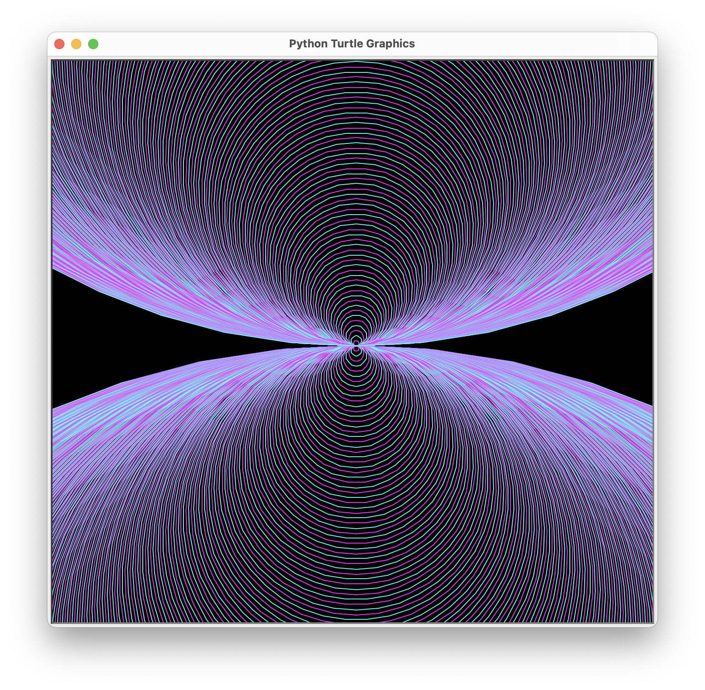
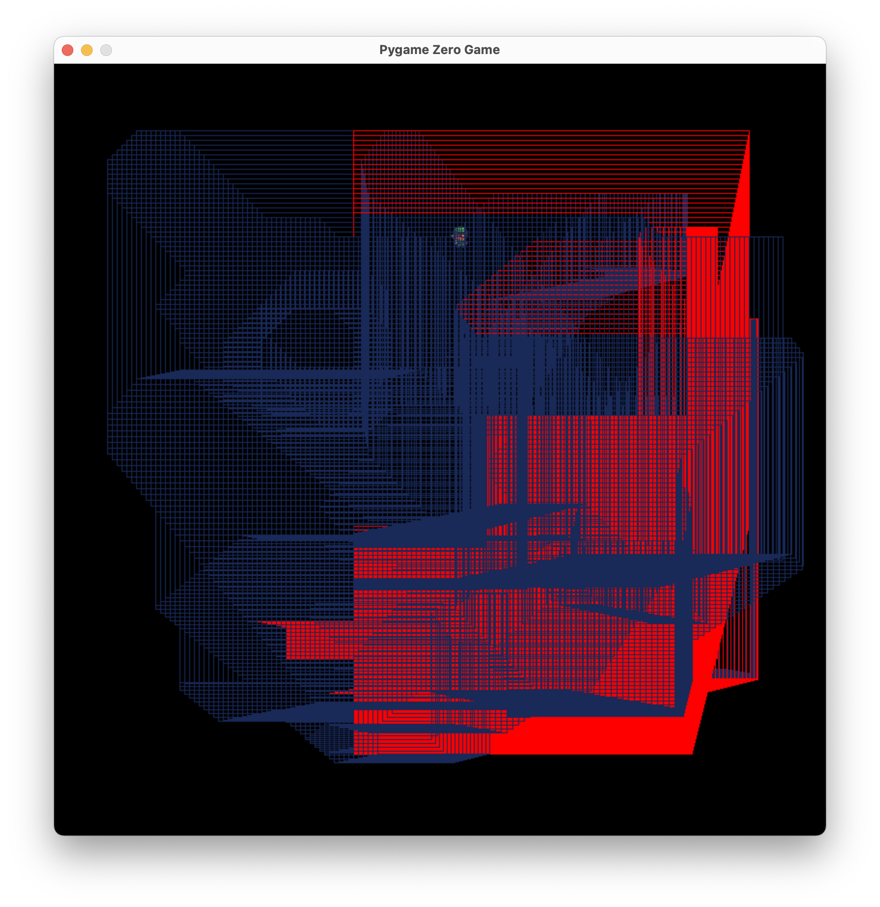

## [DAY-150] While; Classes

Circles And Squares.


```
from turtle import *

bgcolor('black')

a = Turtle()
a.speed(0)
a.hideturtle()

b = Turtle()
b.speed(0)
b.hideturtle()

colorA = textinput('pencolor a',"what is your name?:")
colorB = textinput('pencolor b',"what is your name?:")

size = 0
while True:
    b.pencolor(colorB)
    b.forward(size*3)
    b.left(91)

    a.pencolor(colorA)
    a.forward(size*10)
    a.circle(size, 360)
    a.left(500)

    size += 1
```

More circles



```
import turtle as t
t.bgcolor('black')
t.hideturtle()
size = -300
t.speed(0)
while True:
    if size % 2 == 0:
        t.pencolor('cyan')
    else:
        t.pencolor('magenta')

    t.circle(size*3)
    size += 1
```


## [DAY-151] Classes; While



First make a painting program where you can chose colors and draw rectangles

```
import pgzrun

WIDTH = 800
HEIGHT = 800

elf = Actor('c1')
x = 0
y = 0

color = None
drop = []
size = 40
def update():
    global color,size

    if keyboard.W:
        elf.y -= 5
    if keyboard.S:
        elf.y += 5
    if keyboard.D:
        elf.x += 5
    if keyboard.A:
        elf.x -= 5
    if keyboard.C:
        screen.clear()

    if keyboard.SPACE and color != None:

        drop.append([color, Rect(elf.x, elf.y, size, size)])

    if keyboard.K_1:
        color = (255,0,0)
    if keyboard.K_2:
        color = (25,41, 88)

    if keyboard.K_8:
        size += 1
    if keyboard.K_9:
        size -= 1
def draw():
    screen.clear()
    elf.draw()

    for pixel in drop:
        screen.draw.rect(pixel[1],pixel[0])

    if color != None:
        screen.draw.rect(Rect(elf.x,elf.y,size,size), color)
pgzrun.go()
```

Same program but making a Pixel class instead of a list with color and rect.

```
import pgzrun

WIDTH = 800
HEIGHT = 800


class Pixel:
    def __init__(self, color, x, y, size):
        self.color = color
        self.rect = Rect(x,y,size,size)
    
    def draw(self):
        screen.draw.rect(self.rect, self.color)

elf = Actor('c1')
x = 0
y = 0

color = None
drop = []
size = 40
def update():
    global color,size

    if keyboard.W:
        elf.y -= 5
    if keyboard.S:
        elf.y += 5
    if keyboard.D:
        elf.x += 5
    if keyboard.A:
        elf.x -= 5
    if keyboard.C:
        screen.clear()

    if keyboard.SPACE and color != None:
        pixel = Pixel(color, elf.x, elf.y, size)
        drop.append(pixel)

    if keyboard.K_1:
        color = (255,0,0)
    if keyboard.K_2:
        color = (25, 41, 88)

    if keyboard.K_8:
        size += 1
    if keyboard.K_9:
        size -= 1

def draw():
    screen.clear()
    elf.draw()

    for pixel in drop:
        pixel.draw()

    if color != None:
        screen.draw.rect(Rect(elf.x,elf.y,size,size), color)
pgzrun.go()
```

Go back in the book and re-read the class chapter.

Try out some ideas with a class, just to understand better what `self` is, for example play around with this Point class, try to add `move_right` or `move_up` methods.

```
class Point:
    def __init__(self, x, y):
        self.x = x 
        self.y = y

    def move(self,x,y):
        self.x = x
        self.y = y

    def move_left(self):
        self.x -= 1

    def show(self):
        print(self.x, self.y)

    def equal(self, other_point):
        if self.x == other_point.x and self.y == other_point.y:
            return True

        return False


p1 = Point(10,20)
p2 = Point(30,40)
p3 = Point(10,20)

p3.move(50,60)
p1.show()

p2.show()

p3.move_left()
p3.show()

print(p3.equal(p1))
```

---

Completely unrelated and just for fun, make a triangle like pattern:

````
while True:
    for i in range(0,10):
        print(':3'* i)
    for i in range(10,0,-1):
        print(':D' * i)
```

Prints infinite sequence of smilies

```
:3
:3:3
:3:3:3
:3:3:3:3
:3:3:3:3:3
:3:3:3:3:3:3
:3:3:3:3:3:3:3
:3:3:3:3:3:3:3:3
:3:3:3:3:3:3:3:3:3
:D:D:D:D:D:D:D:D:D:D
:D:D:D:D:D:D:D:D:D
:D:D:D:D:D:D:D:D
:D:D:D:D:D:D:D
:D:D:D:D:D:D
:D:D:D:D:D
:D:D:D:D
:D:D:D
:D:D
:D

:3
:3:3
:3:3:3
:3:3:3:3
:3:3:3:3:3
:3:3:3:3:3:3
...
```
