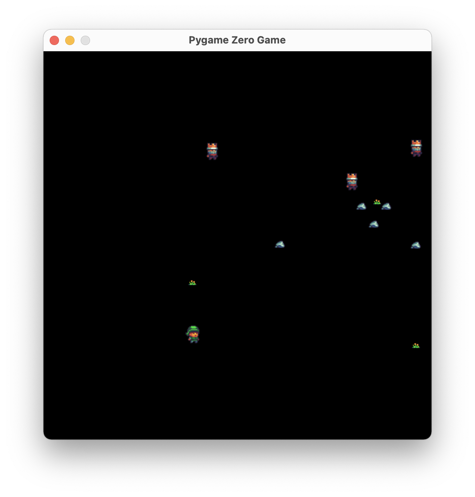
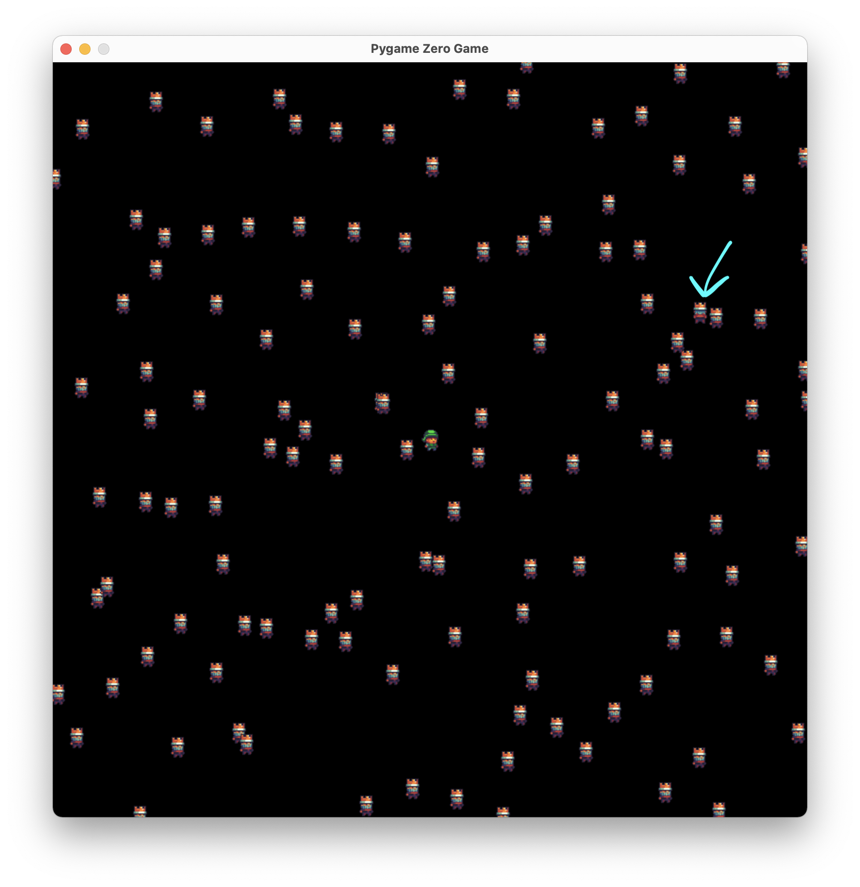

## [DAY-150] While; Classes

Circles And Squares.


```
from turtle import *

bgcolor('black')

a = Turtle()
a.speed(0)
a.hideturtle()

b = Turtle()
b.speed(0)
b.hideturtle()

colorA = textinput('pencolor a',"what is your name?:")
colorB = textinput('pencolor b',"what is your name?:")

size = 0
while True:
    b.pencolor(colorB)
    b.forward(size*3)
    b.left(91)

    a.pencolor(colorA)
    a.forward(size*10)
    a.circle(size, 360)
    a.left(500)

    size += 1
```

More circles


```
import turtle as t
t.bgcolor('black')
t.hideturtle()
size = -300
t.speed(0)
while True:
    if size % 2 == 0:
        t.pencolor('cyan')
    else:
        t.pencolor('magenta')

    t.circle(size*3)
    size += 1
```


## [DAY-151] Classes; While


First make a painting program where you can chose colors and draw rectangles

```
import pgzrun

WIDTH = 800
HEIGHT = 800

elf = Actor('c1')
x = 0
y = 0

color = None
drop = []
size = 40
def update():
    global color,size

    if keyboard.W:
        elf.y -= 5
    if keyboard.S:
        elf.y += 5
    if keyboard.D:
        elf.x += 5
    if keyboard.A:
        elf.x -= 5
    if keyboard.C:
        screen.clear()

    if keyboard.SPACE and color != None:

        drop.append([color, Rect(elf.x, elf.y, size, size)])

    if keyboard.K_1:
        color = (255,0,0)
    if keyboard.K_2:
        color = (25,41, 88)

    if keyboard.K_8:
        size += 1
    if keyboard.K_9:
        size -= 1
def draw():
    screen.clear()
    elf.draw()

    for pixel in drop:
        screen.draw.rect(pixel[1],pixel[0])

    if color != None:
        screen.draw.rect(Rect(elf.x,elf.y,size,size), color)
pgzrun.go()
```

Same program but making a Pixel class instead of a list with color and rect.

```
import pgzrun

WIDTH = 800
HEIGHT = 800


class Pixel:
    def __init__(self, color, x, y, size):
        self.color = color
        self.rect = Rect(x,y,size,size)
    
    def draw(self):
        screen.draw.rect(self.rect, self.color)

elf = Actor('c1')
x = 0
y = 0

color = None
drop = []
size = 40
def update():
    global color,size

    if keyboard.W:
        elf.y -= 5
    if keyboard.S:
        elf.y += 5
    if keyboard.D:
        elf.x += 5
    if keyboard.A:
        elf.x -= 5
    if keyboard.C:
        screen.clear()

    if keyboard.SPACE and color != None:
        pixel = Pixel(color, elf.x, elf.y, size)
        drop.append(pixel)

    if keyboard.K_1:
        color = (255,0,0)
    if keyboard.K_2:
        color = (25, 41, 88)

    if keyboard.K_8:
        size += 1
    if keyboard.K_9:
        size -= 1

def draw():
    screen.clear()
    elf.draw()

    for pixel in drop:
        pixel.draw()

    if color != None:
        screen.draw.rect(Rect(elf.x,elf.y,size,size), color)
pgzrun.go()
```

Go back in the book and re-read the class chapter.

Try out some ideas with a class, just to understand better what `self` is, for example play around with this Point class, try to add `move_right` or `move_up` methods.

```
class Point:
    def __init__(self, x, y):
        self.x = x 
        self.y = y

    def move(self,x,y):
        self.x = x
        self.y = y

    def move_left(self):
        self.x -= 1

    def show(self):
        print(self.x, self.y)

    def equal(self, other_point):
        if self.x == other_point.x and self.y == other_point.y:
            return True

        return False


p1 = Point(10,20)
p2 = Point(30,40)
p3 = Point(10,20)

p3.move(50,60)
p1.show()

p2.show()

p3.move_left()
p3.show()

print(p3.equal(p1))
```

---

Completely unrelated and just for fun, make a triangle like pattern:

```
while True:
    for i in range(0,10):
        print(':3'* i)
    for i in range(10,0,-1):
        print(':D' * i)
```

Prints infinite sequence of smilies

```
:3
:3:3
:3:3:3
:3:3:3:3
:3:3:3:3:3
:3:3:3:3:3:3
:3:3:3:3:3:3:3
:3:3:3:3:3:3:3:3
:3:3:3:3:3:3:3:3:3
:D:D:D:D:D:D:D:D:D:D
:D:D:D:D:D:D:D:D:D
:D:D:D:D:D:D:D:D
:D:D:D:D:D:D:D
:D:D:D:D:D:D
:D:D:D:D:D
:D:D:D:D
:D:D:D
:D:D
:D

:3
:3:3
:3:3:3
:3:3:3:3
:3:3:3:3:3
:3:3:3:3:3:3
...
```


## [DAY-152] Lists



Make 3 actors you can pick up and drop them wherever you hit SPACE.

```
import pgzrun

WIDTH = 500
HEIGHT = 500

king = Actor('c2')
elf = Actor('c1')
flower =  Actor('flower')
rock = Actor('rock')

king.x = 480
king.y = 125
flower.y = 380
flower.x = 480
rock.x = 480
rock.y = 250

drop = []

speed = 5
def update():
    global speed
    if keyboard.W:
        elf.y -= speed
    if keyboard.S:
        elf.y += speed
    if keyboard.D:
        elf.x += speed
    if keyboard.A:
        elf.x -= speed
    if keyboard.C:
        screen.clear()

    if elf.colliderect(king):
        elf.image=king.image
        speed = 2
    if elf.colliderect(rock):
        elf.image=rock.image
        speed = 1
    if elf.colliderect(flower):
        elf.image=flower.image
        speed = 10
    if keyboard.SPACE and elf.image != 'c1':
        a = Actor(elf.image)
        a.x = elf.x
        a.y = elf.y
        drop.append(a)

        elf.image='c1'
        speed = 5

def draw():
    screen.clear()
    elf.draw()
    king.draw()
    flower.draw()
    rock.draw()
    for d in drop:
        d.draw()

pgzrun.go()
```


## [DAY-153] Lists; Dictionaries



Find Waldo, here are two different implementations of the game, one uses dictionaries and one doesnt.

In this game, one of the actors has his back turned, and the purpose of the game is to find them.

We are using this example to practice lists, using `for element in list` and `for i in range(len(list))`, and overusing iterating over the list to find a matching element.

```
import pgzrun
import random

WIDTH = 800
HEIGHT = 800

elf = Actor('c1')
elf.x = 400
elf.y = 400
drop = []

def on_key_down(key):
    if key == keys.SPACE:
        found = False
        for i in drop:
            if i.image == 'c2-back':
                found = True
        if not found:
            a = Actor('c2-back')
            a.x = random.randint(0,1500)
            a.y = random.randint(0,1500)
            drop.append(a)
        for i in range(100):
            a = Actor('c2')
            a.x = random.randint(0,2000)
            a.y = random.randint(0,2000)
            drop.append(a)
    if key == keys.P:
        for i in drop:
            if i.image == 'c2-back':
                i.x = random.randint(elf.x - 200,elf.x + 200)
                i.y = random.randint(elf.y - 200,elf.y + 200)

waldo_found = False
def update():
    global waldo_found
    if keyboard.W:
        for x in range(len(drop)):
            i = drop[x]
            i.y += 5
    if keyboard.S:
        for a in range(len(drop)):
            drop[a].y -= 5
    if keyboard.A:
        for i in drop:
            i.x += 5
    if keyboard.D:
        for i in drop:
            i.x -= 5
    for i in drop:
        if i.image == 'c2-back' and elf.colliderect(i):
            waldo_found = True

def draw():
    screen.fill('black')
    elf.draw()
    for i in drop:
        i.draw()
    if waldo_found == True:
        screen.draw.text(" YOU HAVE FOUND WALDO ", (10,10))

pgzrun.go()
```


A second implementation where we use a `waldo` variable so we dont have to scan the list of actors so many times, and also we move the elf instead of moving all the actors. And we use a dictionary with positions to try to avoid adding an actor close to already existing one.

```
import pgzrun
import random

WIDTH = 800
HEIGHT = 800

elf = Actor('c1')
elf.x = 400
elf.y = 400
drop = []
waldo = Actor('c2-back')
seen = {}
def on_key_down(key):
    if key == keys.SPACE:
        waldo.x = random.randint(0,WIDTH)
        waldo.y = random.randint(0,HEIGHT)
        place = str(int(waldo.x/50)) + "_" + str(int(waldo.y/100))
        seen[place] = True
        for i in range(100):
            x = random.randint(0,WIDTH)
            y = random.randint(0,HEIGHT)
            place = str(int(x/50)) + "_" + str(int(y/100))
            if place not in seen:
                a = Actor('c2')
                a.x = x
                a.y = y
                drop.append(a)
                seen[place] = True

waldo_found = False
def update():
    global waldo_found

    if keyboard.W:
        elf.y -= 5
    if keyboard.S:
        elf.y += 5
    if keyboard.A:
        elf.x -= 5
    if keyboard.D:
        elf.x += 5

    if waldo.colliderect(elf):
        waldo_found = True

def draw():
    screen.fill('black')
    elf.draw()
    for i in drop:
        i.draw()
    waldo.draw()

    if waldo_found == True:
        screen.draw.text(" YOU HAVE FOUND WALDO ", (10,10))

pgzrun.go()
```