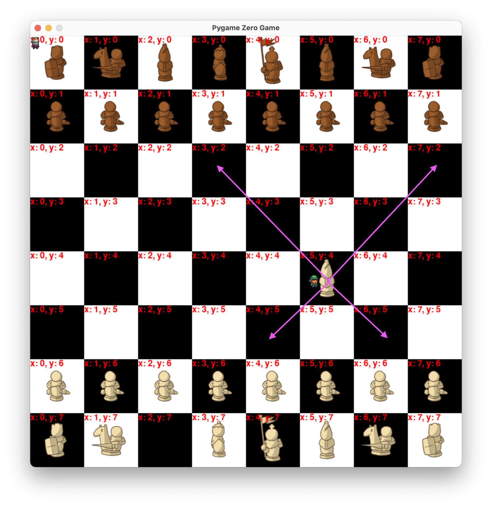
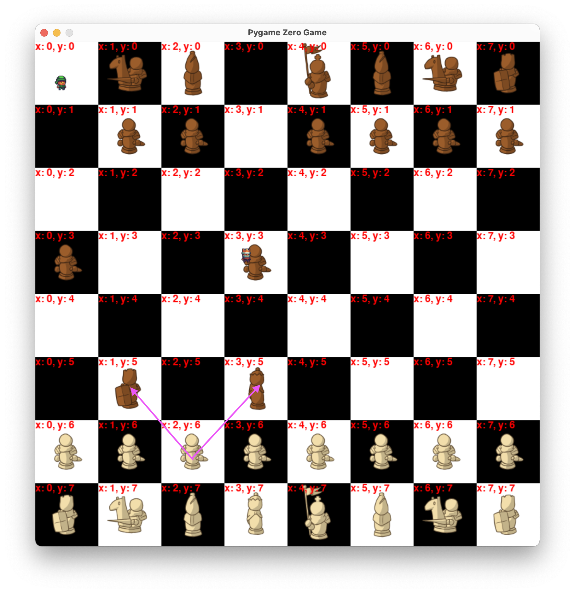

## [DAY-178] if; absolute

Today we will do the rule for the bishop, since the bishop moves in diagonal. You see in the image that the diagonal means that both x and y change with the same absolute amount, lets say we want to move only one square, the possible values are: -1 -1, -1 1, 1 1, 1 -1, meaning move up and left (decrease y and decrease x), up and right (decrease y, increase x), down and right (increase y, indcrease x), down and left (increase y, decrease x). 



Note that if you actually only care if the amount of steps away from the origin, the dirction does not matter. In math when we care about the absolute value of a number we just care about the amount of steps it would take to get from that number to zero, for example from -5 to zero it will take 5 steps, from 5 to zero it will also take 5 steps.

```
<--------------------|-------------------->
 -5  -4  -3  -2  -1  0   1   2   3   4   5
```

Imagine you walking from -5 to zero, or from 5 to zero both will take you 5 steps. So lets write a function that takes a number and if the number is negative we will just turn it into its positive value, as we only care about the amount of steps.


```
def abs(x):
    if x < 0:
        return x * -1
    return x
```

Now lets make the bishop rule. If the steps change in x is the same as the change in y then we must be moving in a diagonal, if not we refuse the move.


```
...

                if pick_white.image == 'chess/bishop-white':
                    # how much did the y change
                    d_y = pick_y - square.y

                    # how much did the x change
                    d_x = pick_x - square.x

                    # if they didnt change the same amount, then its illegal move
                    if abs(d_y) != abs(d_x):
                        return

...
```


## [DAY-179] if; for

Today we will do two more rules, one is the queen and one for the pawn. The queen can move like the rook and the bishop combined, so horizontally, vertically and diagonally. The pawn can move one step diagonally if she can take an enemy piece.

Lets start with the queen, as we already have the rook and bishop rules, it is quite easy, we just have to say 'if the move is not like the rook and not like the bishop then its illegal'.

```
                if pick_white.image == 'chess/rook-white':
                    if square.x != pick_x and square.y != pick_y:
                        return
                if pick_white.image == 'chess/bishop-white':
                    d_y = pick_y - square.y
                    d_x = pick_x - square.x
                    if abs(d_y) != abs(d_x):
                        return
                if pick_white.image == 'chess/queen-white':
                    d_y = pick_y - square.y
                    d_x = pick_x - square.x
                    if abs(d_y) != abs(d_x) and square.x != pick_x and square.y != pick_y:
                        return
...                        

```


The pawn is a bit more complicated, we need to check if the move is actually one step diagonally, and we also need to have a way to check if a piece is on specific position. We will make `is_on_square` function, that takes a position and a list and checks if any of the items of that list is on that position.

```
def is_on_square(x, y, pieces):
    for p in pieces:
        if p.x == x and p.y == y:
            return True

    return False

```


Now that we have the `is_on_square` function, we can simply check if the `y` of the square is exactly on top of the original position, and the `x` of the square is either one to the left or one to the right, which would mean either 1 square left diagonal or right diagonal, and then check if there is a black piece there, if it is allow the move.




```
...
                if pick_white.image == 'chess/pawn-white':
                    # 1 or 2 squares
                    if pick_y == 600:
                        if pick_y - square.y > 200:
                            return
                    if pick_y != 600:
                        if pick_y - square.y > 100:
                            return

                    # pawn can only go left or right if theres someone
                    if pick_x != square.x:
                        ok = False
                        if pick_y - square.y == 100 and pick_x - square.x == 100 and is_on_square(square.x, square.y, black):
                            ok = True
                        if pick_y - square.y == 100 and pick_x - square.x == -100 and is_on_square(square.x, square.y, black):
                            ok = True

                        if not ok:
                            return
...
```

