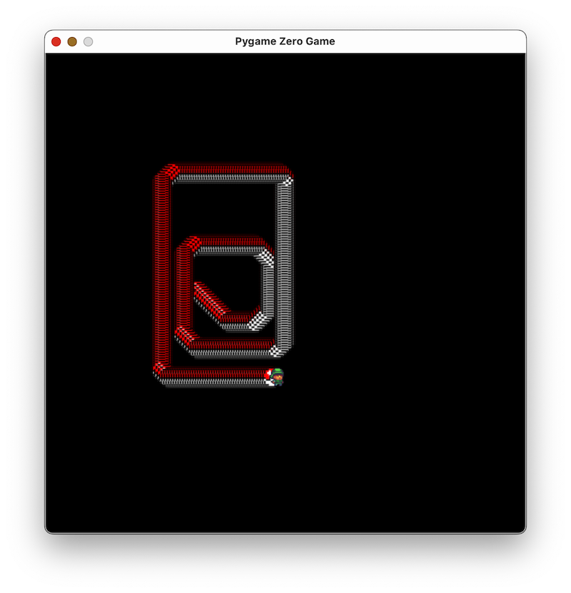
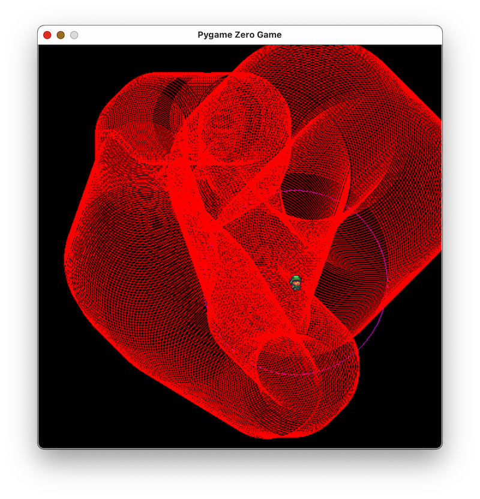

## [DAY-227] lists

Make a touch typing game, have a list of words, pick 4 random words and wait for the player to type them, if they did it correctly, pick another 4 words, otherwise use the old words.

How it should look:

```
hello this is random
> hello this is randon
INCORRECT
hello this is random
> hello this is random
CORRECT
apple orange is amazing
> ...
```

> This is the game she wrote, I had to help with the `join`, and spent some time explaining it.

```
import random
words = ['a', 'about', 'all', 'also', 'and', 'as', 'at', 'be',
         'because', 'but', 'by', 'can', 'come', 'could', 'day',
         'do', 'even', 'find', 'first', 'for', 'from', 'get',
         'give', 'go', 'have', 'he', 'her', 'here', 'him', 'his',
         'how', 'i', 'if', 'in', 'into', 'it', 'its', 'just',
         'know', 'like', 'look', 'make', 'man', 'many', 'me',
         'more', 'my', 'new', 'no', 'not', 'now', 'of', 'on',
         'one', 'only', 'or', 'other', 'our', 'out', 'people',
         'say', 'see', 'she', 'so', 'some', 'take', 'tell',
         'than', 'that', 'the', 'their', 'them', 'then', 'there',
         'these', 'they', 'thing', 'think', 'this', 'those',
         'time', 'to', 'two', 'up', 'use', 'very', 'want', 'way',
         'we', 'well', 'what', 'when', 'which', 'who', 'will',
         'with', 'would', 'year', 'you', 'your',
         'paper', 'game', 'remember', 'person', 'english', 'dutch',
         'amsterdam', 'nothing', 'sleep', 'product', 'natural',
         'juice', 'orange', 'blue', 'green', 'together', 'friends',
         'between', 'music', 'book', 'bookstore', 'fish', 'complete',
         'width', 'weight', 'height', 'length', 'string', 'python',
         'unicode', 'backspace', 'random', 'choice', 'string', 'integer',
         'function', 'print', 'print', 'print', 'for', 'range', 'range',
         ]

def select_words(n):
    picked = []
    for i in range(n):
        word = random.choice(words)
        picked.append(word)
    return " ".join(picked)

scr=4
a = select_words(scr)
while True:
    print(a)

    s = input('> ')
    if s != a:
        print("INCORRECT") 
    else:
        print("CORRECT")
        a = select_words(scr)
        scr+=1
```


## [DAY-228] files

Google for the top 10000 most common words in the english language, and paste them into a file 'words.txt'. Then google: `how to read file in python`, and go to some of the `stackoverflow` links.

> This is what she wrote after pasting from stackoverflow:

```
import random
f = open('words.txt') # Open file on read mode
words = f.read().splitlines() # List with stripped line-breaks
f.close() # Close file

def select_words(n):
    picked = []
    for i in range(n):
        word = random.choice(words)
        picked.append(word)
    return " ".join(picked)

scr=4
a = select_words(scr)
while True:
    print(a)

    s = input('> ')
    if s != a:
        print("INCORRECT") 
    else:
        print("CORRECT")
        a = select_words(scr)
        scr+=1
```

Spend some time on chaining methods `f.read()` returns a string, then calling `.splitlines()` on the string returns a list of strings.

## [DAY-229] strings

Improve the game to print which character is different from the user input.

> We spent most of the time discussing strings and indexes, in the end that is what she wrote.

```
import random
f = open('words.txt') # Open file on read mode
words = f.read().splitlines() # List with stripped line-breaks
f.close() # Close file

def select_words(n):
    picked = []
    for i in range(n):
        word = random.choice(words)
        picked.append(word)
    return " ".join(picked)

scr=4
a = select_words(scr)
while True:
    print(a)

    s = input('> ')
    if s != a:
        print("INCORRECT") 

        for i in range(len(a)):
            if len(s) <= i:
                print(a[i] + " SORRY MISSING")
            else:
                if a[i] != s[i]:
                    print(a[i] + " != " + s[i])
                else:
                    print(a[i])
    else:
        print("CORRECT")
        a = select_words(scr)
        scr+=1

```

## [DAY-229] files; strings



Make a game that draws with an image and you can save the image and load it. Copy the game from [day 99](https://github.com/jackdoe/programming-for-kids#day-99-classes-lists-functions-cartesian-coordinates) and think it through, google "how to split string in python". Play with the str.split in the python interpreter. Also think about what file.readlines() does.


```
import pgzrun
import sys # for sys.exit()
import random

HEIGHT = 600
WIDTH = 600

elf = Actor("elf")
speed = 3
back = []
def update():
    global score
    if keyboard.A:
        elf.x -= speed
    if keyboard.D:
        elf.x += speed
    if keyboard.W:
        elf.y -= speed
    if keyboard.S:
        elf.y += speed
    if keyboard.J:
        f = Actor('bullet')
        f.x = elf.x
        f.y = elf.y
        back.append(f)

    if keyboard.M:
        f = open("save.txt", "w")
        for x in back:
            f.write(str(x.x))
            f.write(",")
            f.write(str(x.y))
            f.write("\n")
        f.close()
    if keyboard.L:
        f = open("save.txt", "r")
        for line in f.readlines():
            (x,y) = line.split(",") # 30,20
            a = Actor('bullet')
            a.x = float(x) # "40" 40
            a.y = float(y)
            back.append(a)
        f.close()
    if keyboard.Q:
        sys.exit(0)

def draw():
    screen.fill('black')
    for i in back:
        i.draw()

    elf.draw()

pgzrun.go()

```

## [DAY-230] dictionaries



Make a drawing game that draws a circle with different size.

```
import pgzrun
import sys  # for sys.exit()
import random

HEIGHT = 600
WIDTH = 600

elf = Actor("elf")
speed = 3
back = []
radius = 5

def update():
    global score,radius
    if keyboard.A:
        elf.x -= speed
    if keyboard.D:
        elf.x += speed
    if keyboard.W:
        elf.y -= speed
    if keyboard.S:
        elf.y += speed
    if keyboard.K_1:
        radius += 1
    if keyboard.K_2:
        radius -= 1
    if keyboard.J:
        f = {
            "x": elf.x, # x position
            "y": elf.y, # y position
            "color": [255, 0, 0], # color
            "radius": radius # current radius
        }

        back.append(f)

    if keyboard.Q:
        sys.exit(0)


def draw():
    screen.fill('black')

    screen.draw.circle(
        [elf.x,elf.y],  # position
        radius,         # radius
        [255,0,255]     # color
    )

    for circle in back:
        screen.draw.circle(
            [circle["x"], circle["y"]], # position
            circle["radius"],           # radius
            circle["color"]             # color
        )

    elf.draw()


pgzrun.go()
```


> Spend significant amount of time discussing the dictionaries, first start with static radius of 20 pixels, then add it as a variable that you can change.
