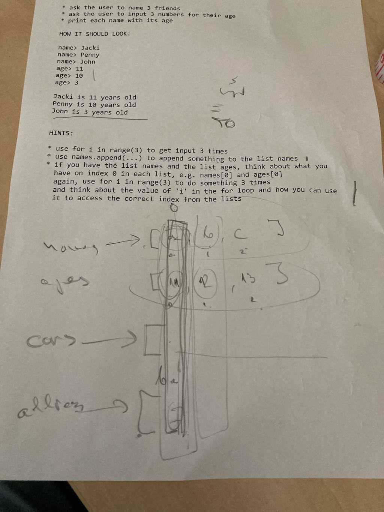
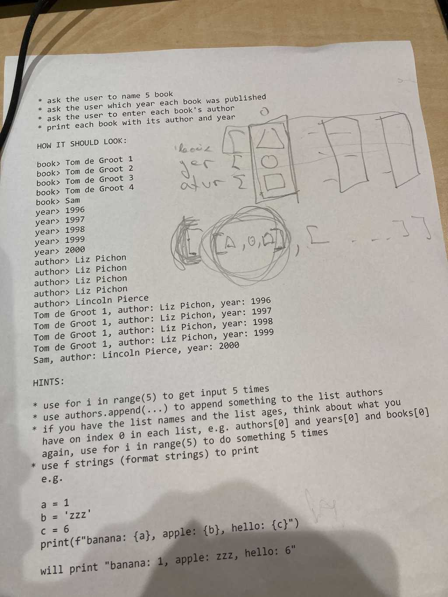
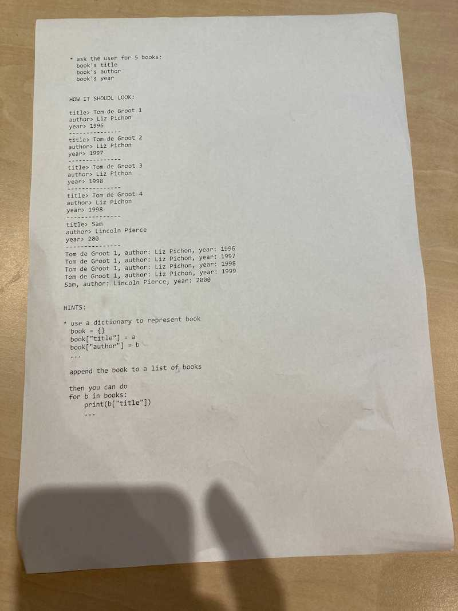
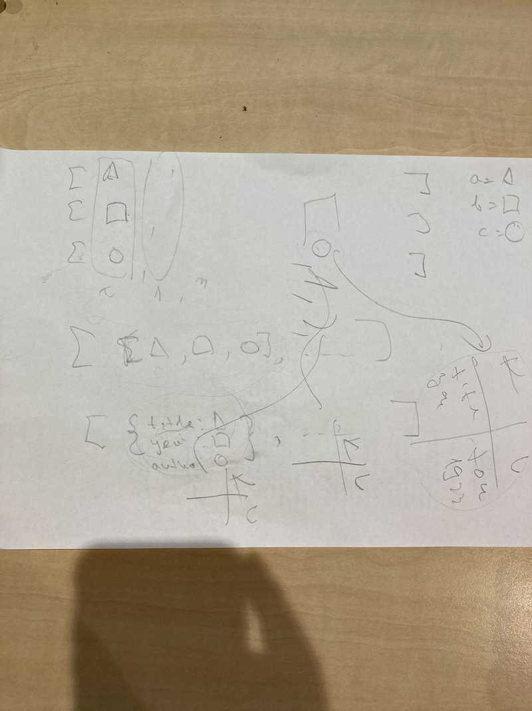
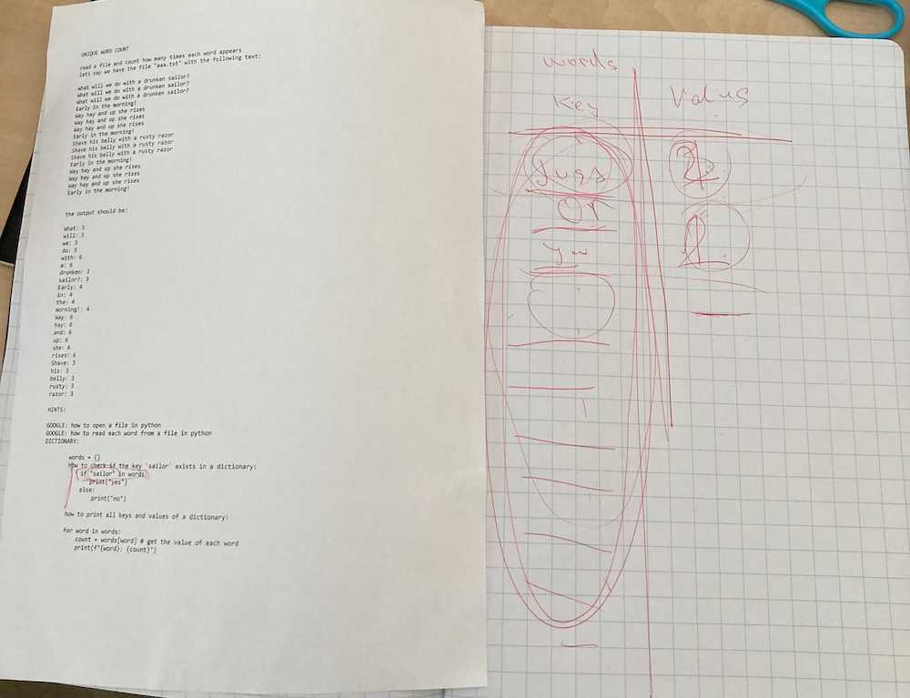

## [DAY-246] strings

```
# make a function to count how many times a given character
# appears in a string

def count(c, s):
    # .. count how many times `c` appears in `s`
    # example string s "hello"
    # example character c "l"
    return 0


n = count("l","hello")
print(f"character l appears {n} times")

# what would happen if we do: n = count(1, [1,2,3,4,1,5])

```


## [DAY-247] lists



```
* ask the user to name 3 friends
* ask the user to input 3 numbers for their age
* print each name with its age

HOW IT SHOULD LOOK:

name> Jacki
name> Penny
name> John
age> 11
age> 10
age> 3

Jacki is 11 years old
Penny is 10 years old
John is 3 years old


HINTS:

* use for i in range(3) to get input 3 times
* use names.append(...) to append something to the list names
* if you have the list names and the list ages, think about what you
  have on index 0 in each list, e.g. names[0] and ages[0]
  again, use for i in range(3) to do something 3 times
  and think about the value of 'i' in the for loop and how you can use
  it to access the correct index from the lists
```

## [DAY-248] lists



```
* ask the user to name 5 book
* ask the user which year each book was published
* ask the user to enter each book's author
* print each book with its author and year

HOW IT SHOULD LOOK:

book> Tom de Groot 1
book> Tom de Groot 2
book> Tom de Groot 3
book> Tom de Groot 4
book> Sam
year> 1996
year> 1997
year> 1998
year> 1999
year> 2000
author> Liz Pichon
author> Liz Pichon
author> Liz Pichon
author> Liz Pichon
author> Lincoln Pierce


Tom de Groot 1, author: Liz Pichon, year: 1996
Tom de Groot 1, author: Liz Pichon, year: 1997
Tom de Groot 1, author: Liz Pichon, year: 1998
Tom de Groot 1, author: Liz Pichon, year: 1999
Sam, author: Lincoln Pierce, year: 2000


HINTS:

* use for i in range(5) to get input 5 times
* use authors.append(...) to append something to the list authors
* if you have the list names and the list ages, think about what you
  have on index 0 in each list, e.g. authors[0] and years[0] and books[0]
  again, use for i in range(5) to do something 5 times
* use f strings (format strings) to print
  e.g.

  a = 1
  b = 'zzz'
  c = 6
  print(f"banana: {a}, apple: {b}, hello: {c}")

  will print "banana: 1, apple: zzz, hello: 6"
```

## [DAY-249] lists

```
* ask the user for 5 books:
  book's title
  book's author
  book's year


HOW IT SHOUDL LOOK:

title> Tom de Groot 1
author> Liz Pichon
year> 1996
---------------
title> Tom de Groot 2
author> Liz Pichon
year> 1997
---------------
title> Tom de Groot 3
author> Liz Pichon
year> 1998
---------------
title> Tom de Groot 4
author> Liz Pichon
year> 1998
---------------
title> Sam
author> Lincoln Pierce
year> 200
---------------
Tom de Groot 1, author: Liz Pichon, year: 1996
Tom de Groot 1, author: Liz Pichon, year: 1997
Tom de Groot 1, author: Liz Pichon, year: 1998
Tom de Groot 1, author: Liz Pichon, year: 1999
Sam, author: Lincoln Pierce, year: 2000


HINTS:

* use 1 list of 3 elements to represent a book
  [title, author, year]
  append this small list to a big list of books

```


## [DAY-250] dictionaries





```
* ask the user for 5 books:
  book's title
  book's author
  book's year


HOW IT SHOUDL LOOK:

title> Tom de Groot 1
author> Liz Pichon
year> 1996
---------------
title> Tom de Groot 2
author> Liz Pichon
year> 1997
---------------
title> Tom de Groot 3
author> Liz Pichon
year> 1998
---------------
title> Tom de Groot 4
author> Liz Pichon
year> 1998
---------------
title> Sam
author> Lincoln Pierce
year> 200
---------------
Tom de Groot 1, author: Liz Pichon, year: 1996
Tom de Groot 1, author: Liz Pichon, year: 1997
Tom de Groot 1, author: Liz Pichon, year: 1998
Tom de Groot 1, author: Liz Pichon, year: 1999
Sam, author: Lincoln Pierce, year: 2000


HINTS:

* use a dictionary to represent book
  book = {}
  book["title"] = a
  book["author"] = b
  ...

  append the book to a list of books

  then you can do
  for b in books:
      print(b["title"])
      ...
```


## [DAY-251] dictionaries




```
UNIQUE WORD COUNT


read a file and count how many times each word appears
lets say we have the file "aaa.txt" with the following text:

What will we do with a drunken sailor?
What will we do with a drunken sailor?
What will we do with a drunken sailor?
Early in the morning!
Way hay and up she rises
Way hay and up she rises
Way hay and up she rises
Early in the morning!
Shave his belly with a rusty razor
Shave his belly with a rusty razor
Shave his belly with a rusty razor
Early in the morning!
Way hay and up she rises
Way hay and up she rises
Way hay and up she rises
Early in the morning!


the output should be:

What: 3
will: 3
we: 3
do: 3
with: 6
a: 6
drunken: 3
sailor?: 3
Early: 4
in: 4
the: 4
morning!: 4
Way: 6
hay: 6
and: 6
up: 6
she: 6
rises: 6
Shave: 3
his: 3
belly: 3
rusty: 3
razor: 3


HINTS:

GOOGLE: how to open a file in python
GOOGLE: how to read each word from a file in python


DICTIONARY:

        words = {}
        how to check if the key `sailor` exists in a dictionary:
            if "sailor" in words:
               print("yes")
            else:
                print("no")

        how to print all keys and values of a dictionary:

        for word in words:
            count = words[word] # get the value of each word
            print(f"{word}: {count}")
```


## [DAY-252] dictionaries

```
* UNIQUE INPUTS

ask the user to enter 10 strings, and after they are done,
print only the unique ones

> asda
> zz
> asda
...
unique inputs:
asda, zz


HINTS:

in a dictionary table, the keys are unique
a = {}
a["aaa"] = "hello"
a["aaa"] = "bzbz"
print(a["aaa"]) will print 'bzbz' because we will
overwrite the value for the key 'aaa'


* UNIQUE ELEMENTS IN A LIST

write a function, that takes a list of numbers, and returns a new list only with
the unique elements


def uniq(a):
    b = []
    # ...
    return b


print(uniq([1,2,1,1,1,1,2,2,1,1,1,1,3,4]))

# should print
# [1,2,3,4]

HINTS:
dictionary keys can be integers as well, e.g.:

a = {}
b = 88
a[b] = 5

print(a[b])
```

## [DAY-253] dictionaries

```
* COUNT

write a function to count how many times elements appear in a list

def count(a):
    b = {}
    # ....
    return b

print(count([1,2,1,1,"aaa","bbb",1,1,2,2,1,"aaa",1,1,1,3,4]))

# should print
# {1: 9, 2: 3, 'aaa': 2, 'bbb': 1, 3: 1, 4: 1}

HINTS:

to check if a key is in a dictionary use 'in':

d = {}
k = "hello"
if k in d:
    print("YES")
else:
    print("NO")


think about a dictionary table that looks like this:

key   | value
------+------
"aaa" | 2
1     | 9
...
```
